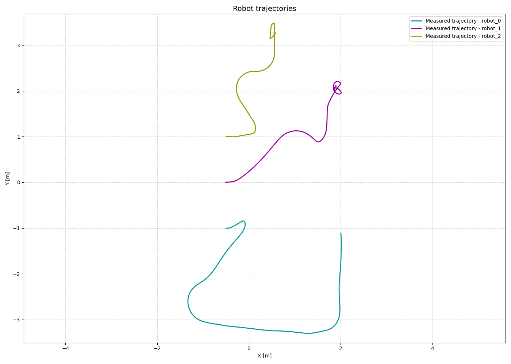
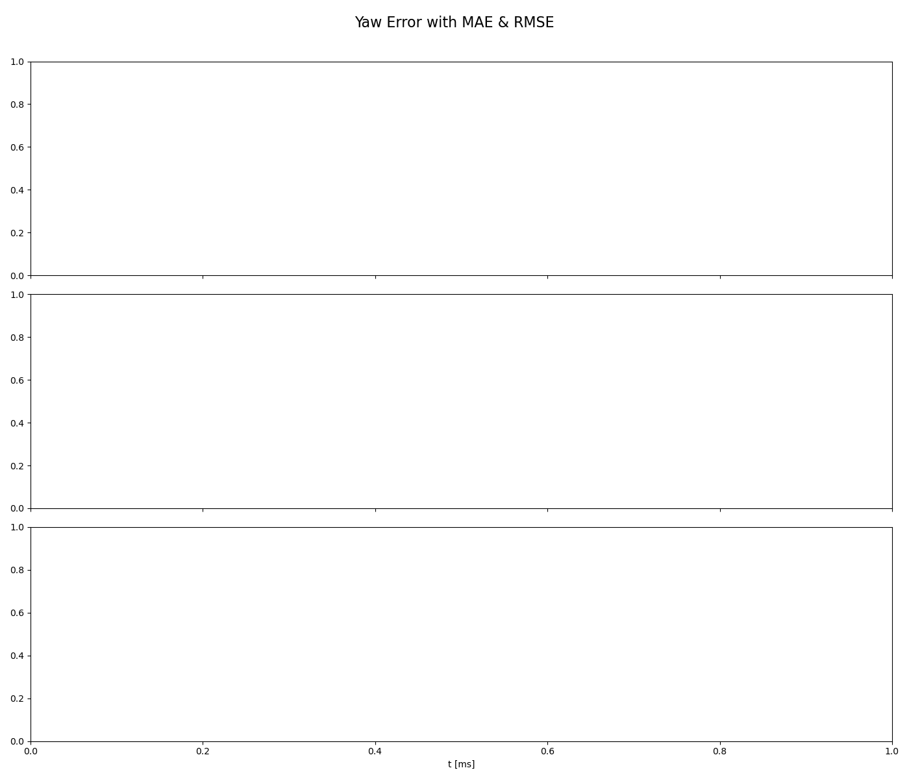
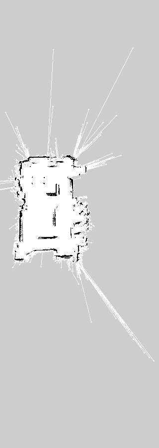
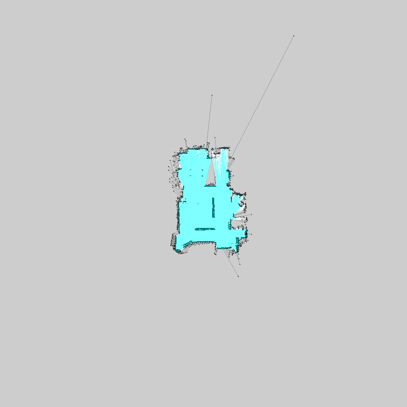
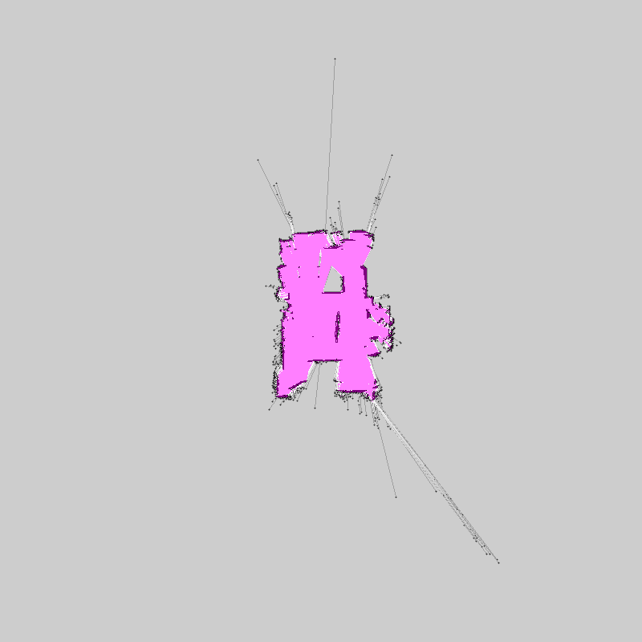
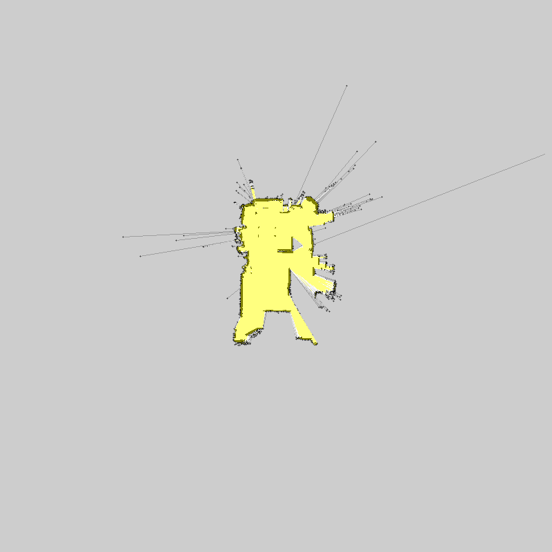
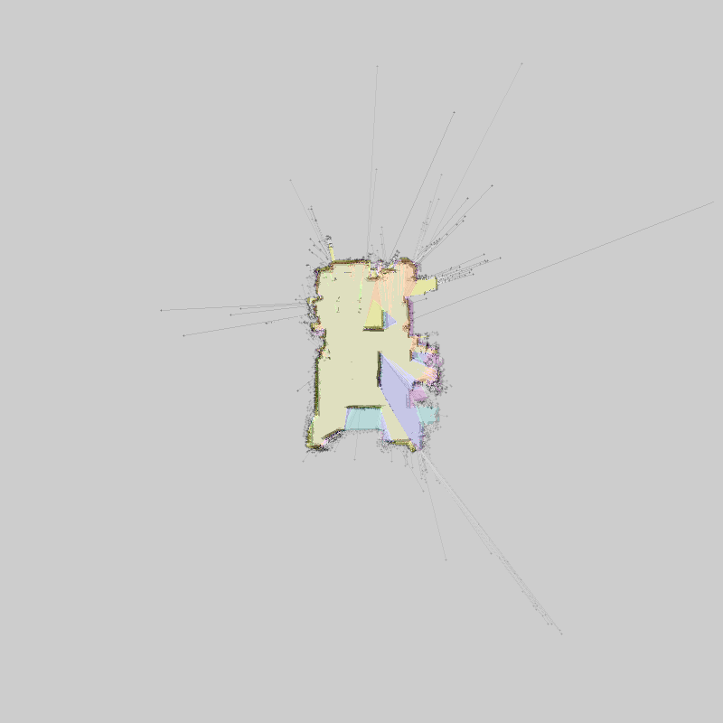
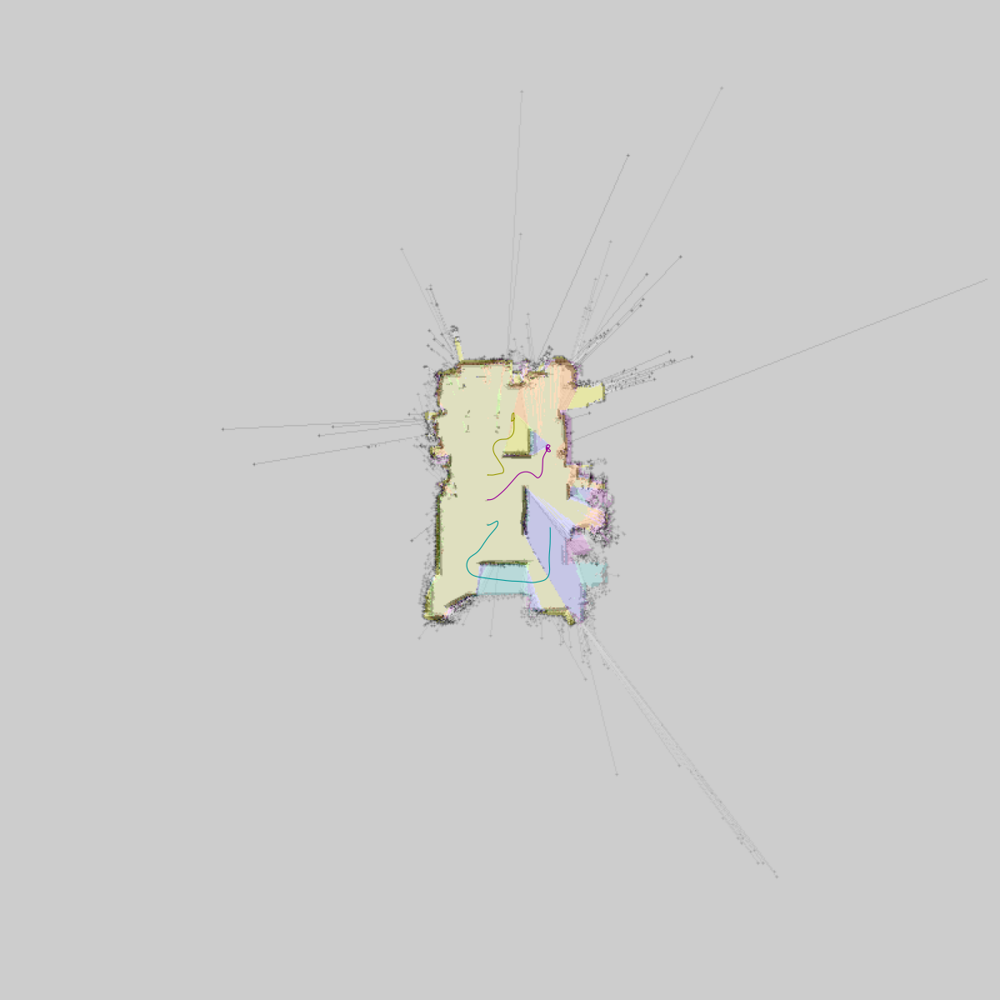

# Multirobot Collaborative SLAM Evaluation Report

**Bag ID:** bag_2026_03_06_03_02_55

**Experiment Date:** 2026-03-06

**Experiment Time:** 03:02:55

**Evaluation Date:** 2026-03-06

**Robots:**
`robot_0`
`robot_1`
`robot_2`

## Timing evaluation:

**Bag record time:** 55446 ms

| Robot ID | Success | Last cmd (linear_x, angular_z) | Execution time |
|----------|---------|--------------------------------|----------------|
| `robot_0` | No | 0.300 m/s, 0.307 rad/s | **55446 ms** (55.446 s) |
| `robot_1` | No | 0.012 m/s, -1.000 rad/s | **55446 ms** (55.446 s) |
| `robot_2` | No | 0.063 m/s, 1.000 rad/s | **55446 ms** (55.446 s) |

**Exploration gap:** 0 ms

**Total time:** 55446 ms

## Localization evaluation:

| Robot ID | Success | Ground truth | Traveled distance | Final distance error | Distance MAE | Distance RMSE | Distance STD | Final yaw error | Yaw MAE | Yaw RMSE | Yaw STD |
|----------|---------|--------------|-------------------|----------------------|--------------|---------------|--------------|-----------------|---------|----------|---------|
| `robot_0` | No | No | - | - | - | - | - | - | - |
| `robot_1` | No | No | - | - | - | - | - | - | - |
| `robot_2` | No | No | - | - | - | - | - | - | - |

### Localization results:

**Localization result:**

**Distance error:**

**Yaw error:**

## Mapping evaluation:

**Map resolution:** 0.05 m/pixel

**Dimension:** 800 x 800 cells (40.00 x 40.00 m)

**Map origin:** (-20.0, -20.0, 0.0)

**Explored area:** 81.49 m²

**Explored area ratio:** 74.22%

| Robot ID | Exploration area | Exploration percentage |
|----------|------------------|------------------------|
| `robot_0` | 61.60 m² | 75.60% |
| `robot_1` | 68.15 m² | 83.63% |
| `robot_2` | 59.76 m² | 73.33% |
| `robot_0`, `robot_1` | 75.29 m² | 92.39% |
| `robot_0`, `robot_2` | 73.83 m² | 90.59% |
| `robot_1`, `robot_2` | 78.07 m² | 95.81% |
| `robot_0`, `robot_1`, `robot_2` | 83.86 m² | 100.00% |

**Mapping accuracy**: 0.8769 (15427/17593 compared cells)
| Quantity | Value |
|--------|-------|
| True Positives (TP)  | 165 |
| True Negatives (TN)  | 15262 |
| False Positives (FP) | 997 |
| False Negatives (FN) | 1169 |

| Metric | Value |
|--------|-------|
| True Positive Rate (TPR)  | 0.12368815592203898 |
| True Negative Rate (TNR)  | 0.9386801156282675 |
| False Positive Rate (FPR) | 0.06131988437173258 |
| False Negative Rate (FNR) | 0.876311844077961 |
### Mapping results:

**Map ground truth:**

**Map result:**

**Map error:**

**Map confusion:**

Grey = not_evaluated, Green = TP, White = TN, Blue = FP, RED = FN

**Map robot_0:**

**Map robot_1:**

**Map robot_2:**

**Map merged:**

**Map merged with robot trajectories:**

