# Multirobot Collaborative SLAM Evaluation Report

**Bag ID:** bag_2026_02_16_23_50_25

**Experiment Date:** 2026-02-16

**Experiment Time:** 23:50:25

**Evaluation Date:** 2026-02-17

**Robots:**
`robot_0`
`robot_1`
`robot_2`

## Timing evaluation:

**Bag record time:** 42500 ms

| Robot ID | Success | Last cmd (linear_x, angular_z) | Execution time |
|----------|---------|--------------------------------|----------------|
| `robot_0` | No | 0.220 m/s, 0.427 rad/s | **42500 ms** (42.500 s) |
| `robot_1` | No | 0.220 m/s, -0.039 rad/s | **41033 ms** (41.033 s) |
| `robot_2` | No | 0.220 m/s, 0.405 rad/s | **42058 ms** (42.058 s) |

**Exploration gap:** 1467 ms

**Total time:** 42500 ms

## Localization evaluation:

| Robot ID | Success | Ground truth | Final distance error | Distance MAE | Distance RMSE | Distance STD | Final yaw error | Yaw MAE | Yaw RMSE | Yaw STD |
|----------|---------|--------------|----------------------|--------------|---------------|--------------|-----------------|---------|----------|---------|
| `robot_0` | No | Yes | - | - | - | - | - | - |
| `robot_1` | No | Yes | - | - | - | - | - | - |
| `robot_2` | No | Yes | - | - | - | - | - | - |

### Localization results:

**Localization result:**

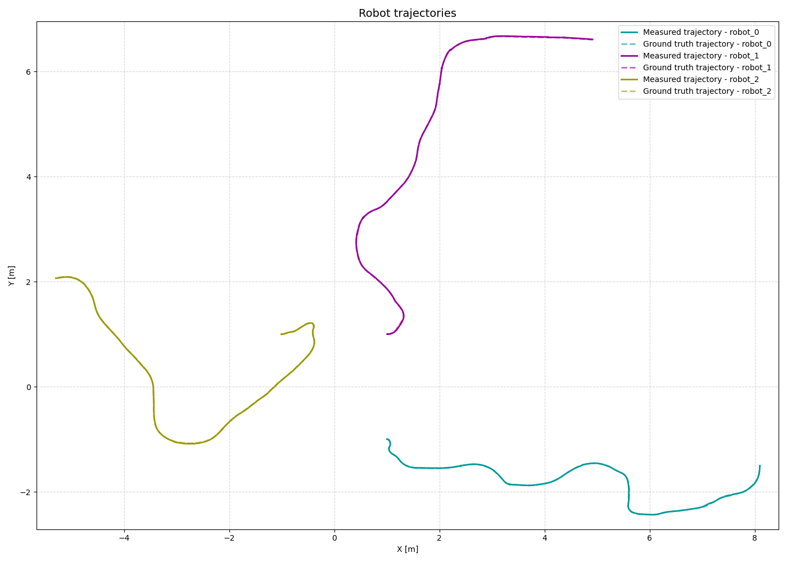

**Distance error:**

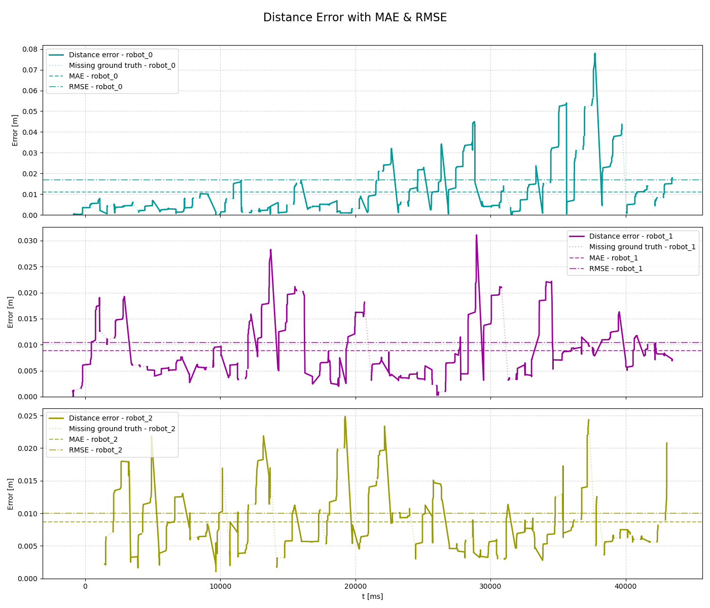

**Yaw error:**

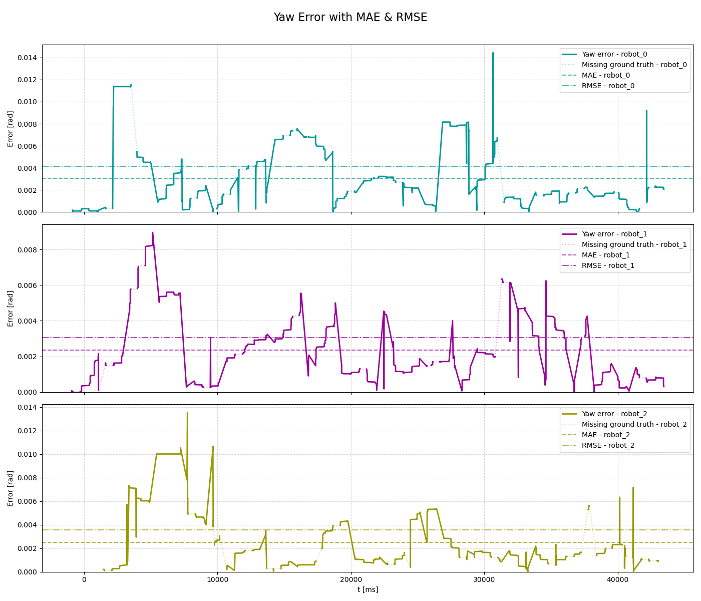

## Mapping evaluation:

**Map resolution:** 0.05 m/pixel

**Dimension:** 800 x 800 cells (40.00 x 40.00 m)

**Map origin:** (-20.0, -20.0, 0.0)

**Explored area:** 304.01 m²

| Robot ID | Exploration area | Exploration percentage |
|----------|------------------|------------------------|
| `robot_0` | 177.84 m² | 58.50% |
| `robot_1` | 126.45 m² | 41.59% |
| `robot_2` | 146.06 m² | 48.05% |
| `robot_0`, `robot_1` | 220.42 m² | 72.50% |
| `robot_0`, `robot_2` | 283.20 m² | 93.15% |
| `robot_1`, `robot_2` | 221.74 m² | 72.94% |
| `robot_0`, `robot_1`, `robot_2` | 309.35 m² | 100.00% |

**Mapping accuracy**: 0.9811 (2978157/3035425 compared cells)
| Quantity | Value |
|--------|-------|
| True Positives (TP)  | 66026 |
| True Negatives (TN)  | 2912131 |
| False Positives (FP) | 25524 |
| False Negatives (FN) | 31744 |

| Metric | Value |
|--------|-------|
| True Positive Rate (TPR)  | 0.6753196276976577 |
| True Negative Rate (TNR)  | 0.99131143718374 |
| False Positive Rate (FPR) | 0.008688562816259907 |
| False Negative Rate (FNR) | 0.32468037230234226 |
### Mapping results:

**Map ground truth:**

**Map result:**

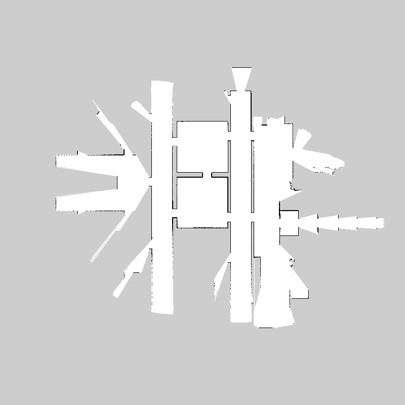

**Map error:**

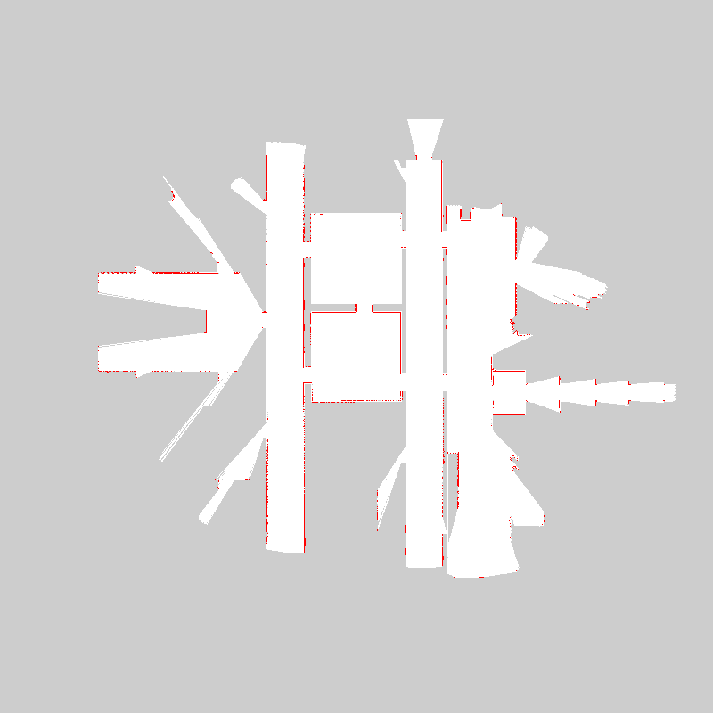

**Map confusion:**

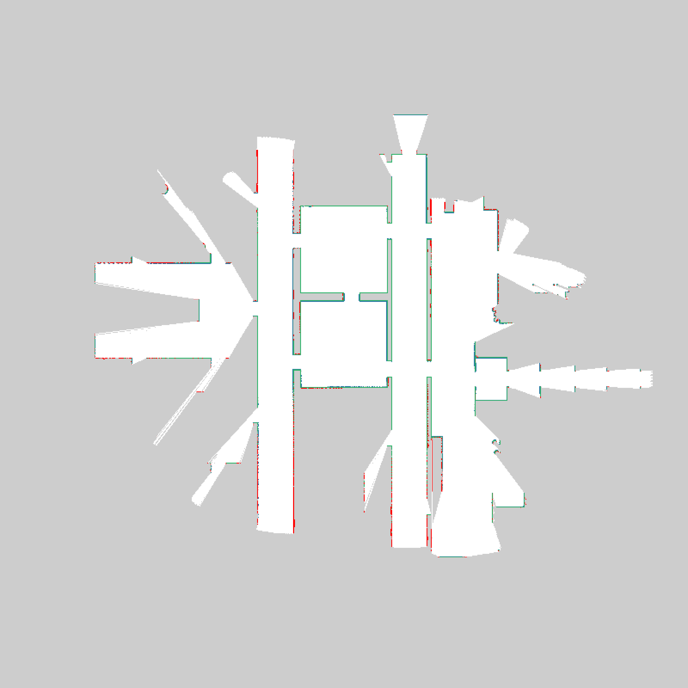

Grey = not_evaluated, Green = TP, White = TN, Blue = FP, RED = FN

**Map robot_0:**

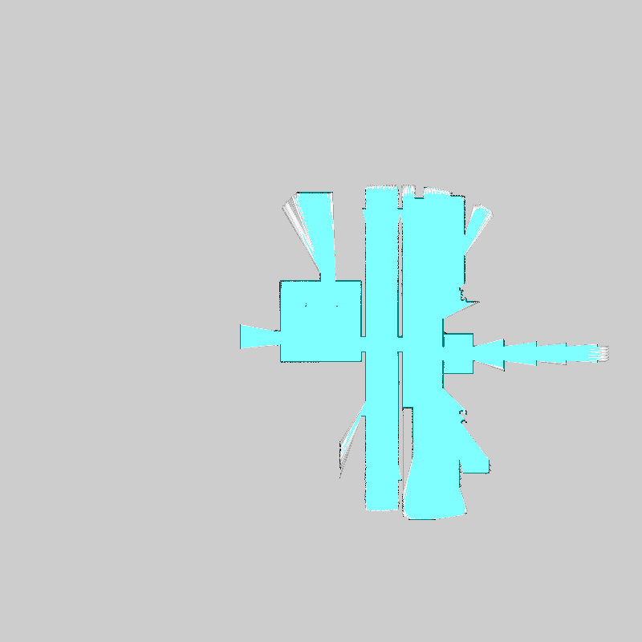

**Map robot_1:**

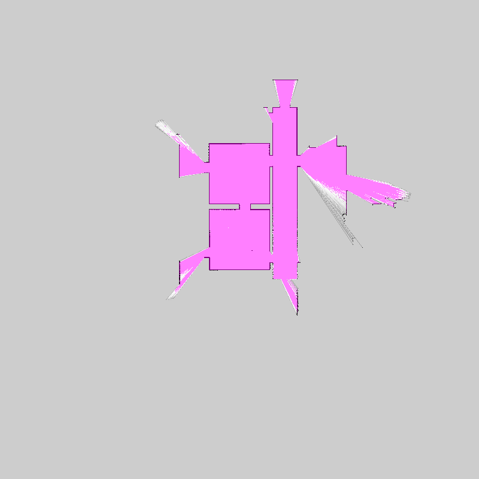

**Map robot_2:**

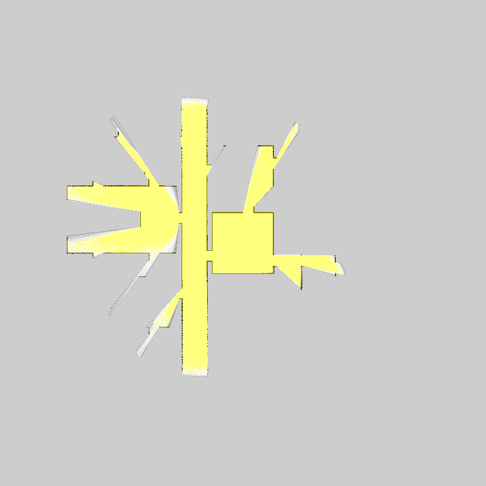

**Map merged:**

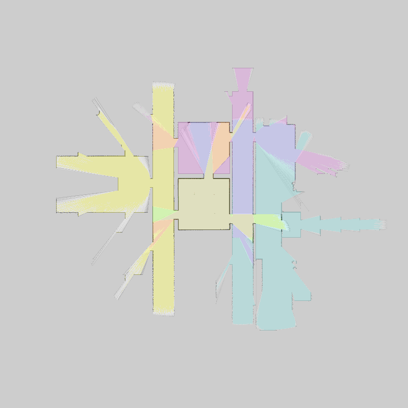

**Map merged with robot trajectories:**

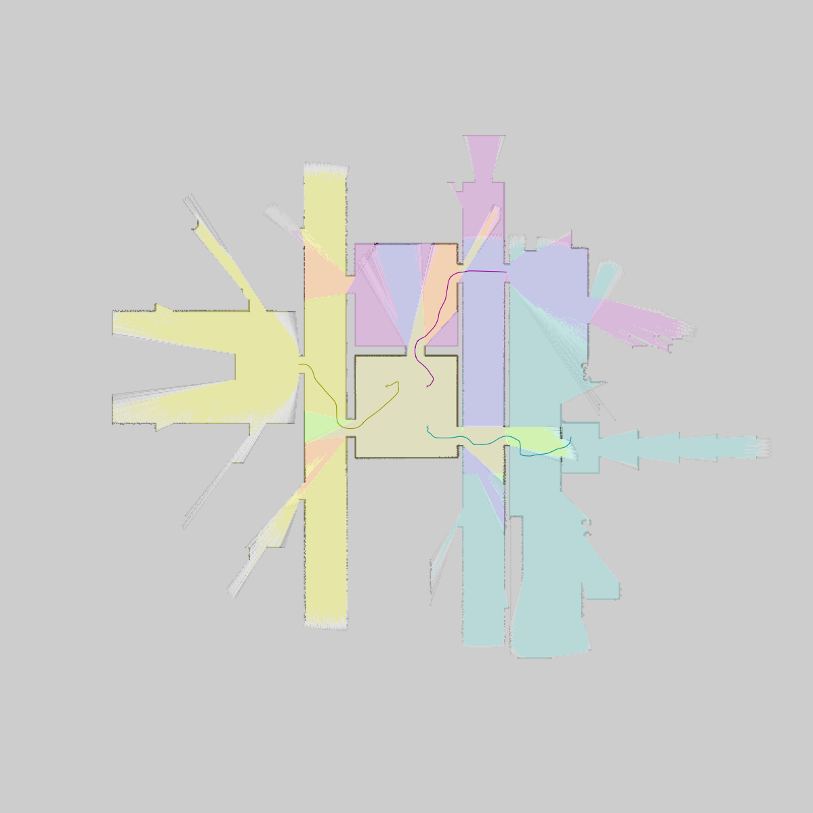

