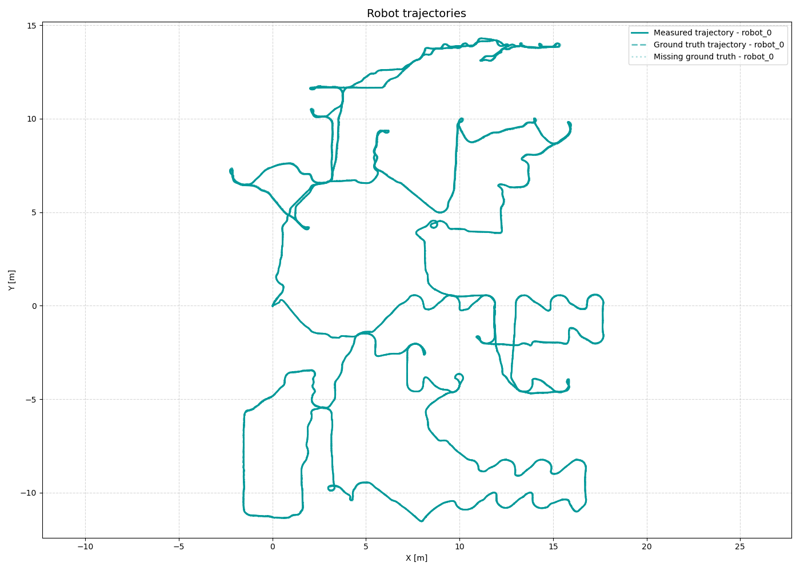
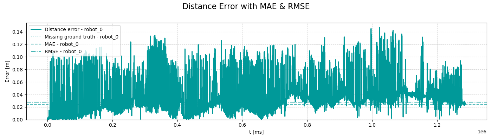
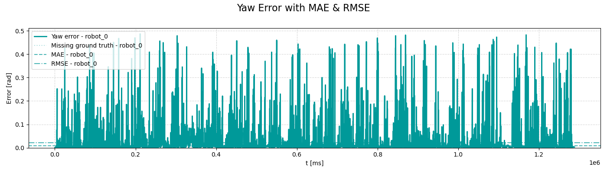
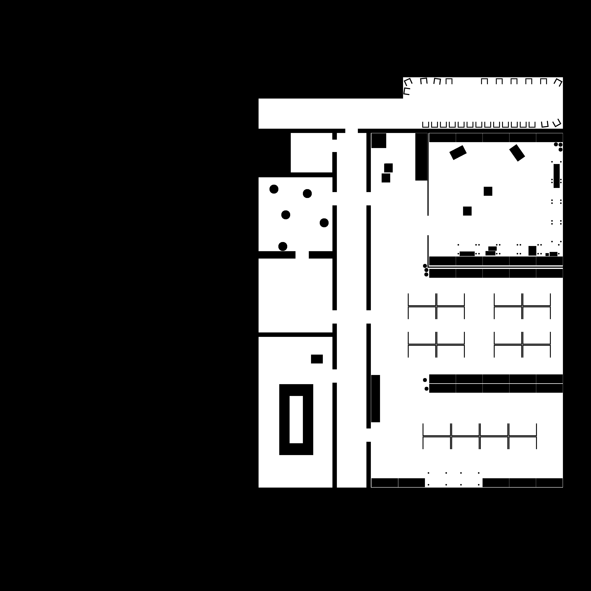
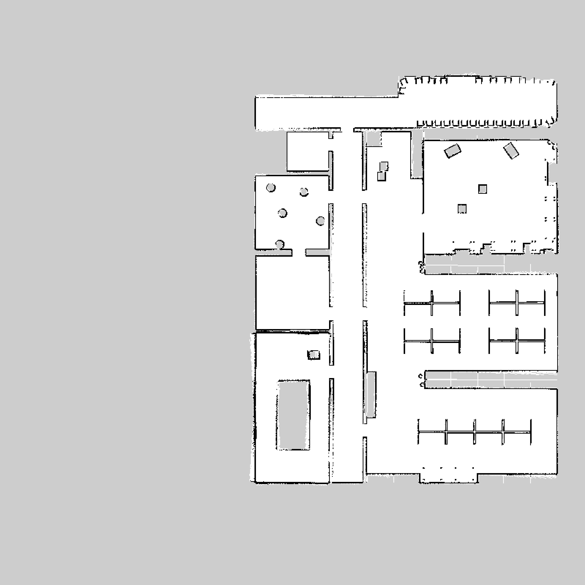
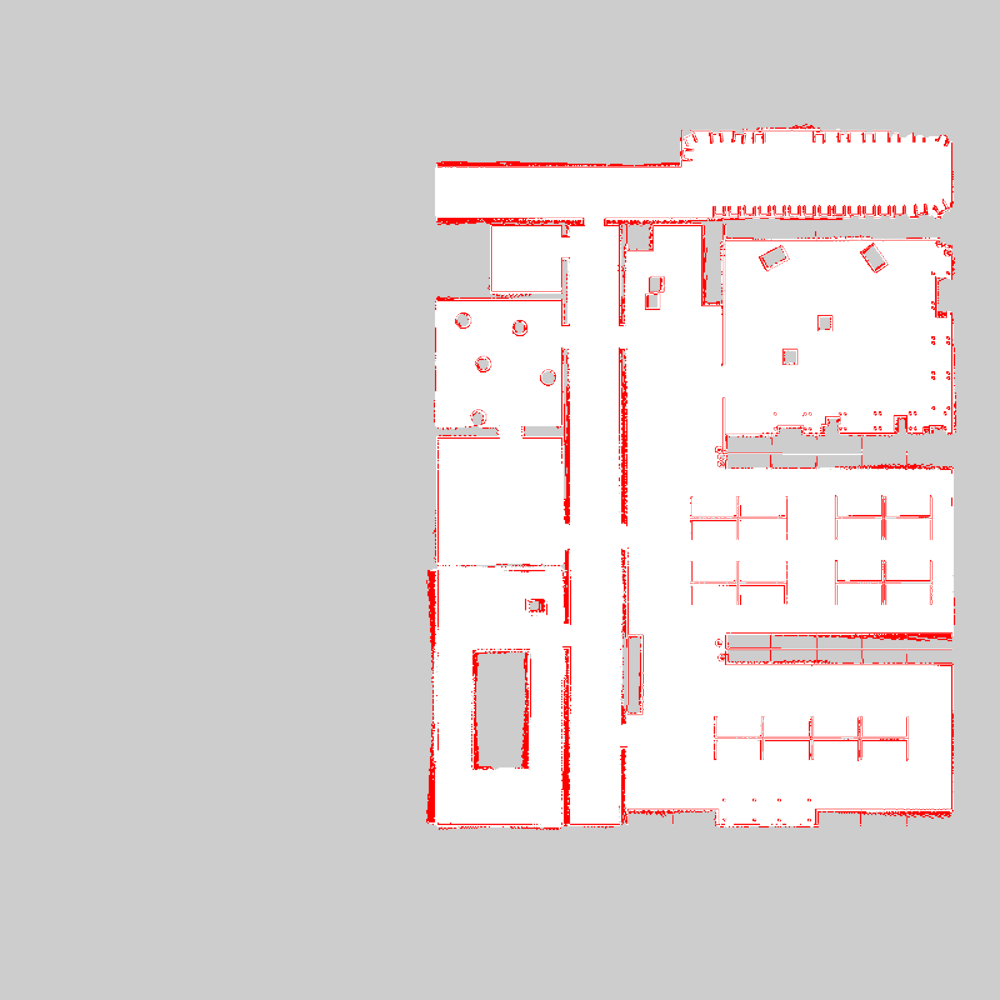
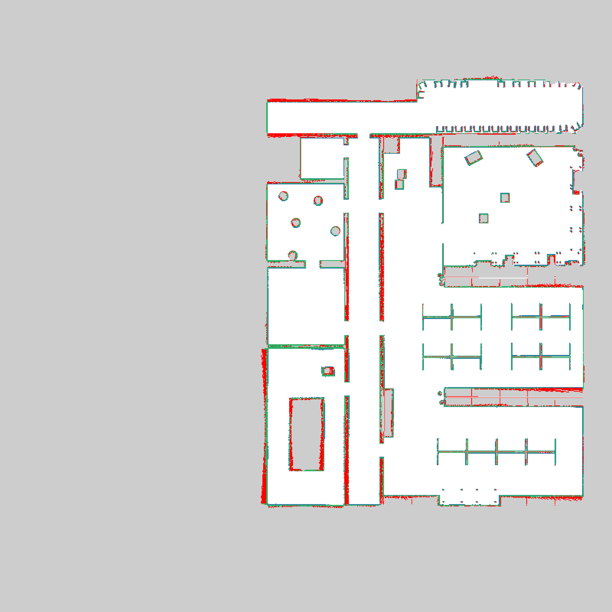
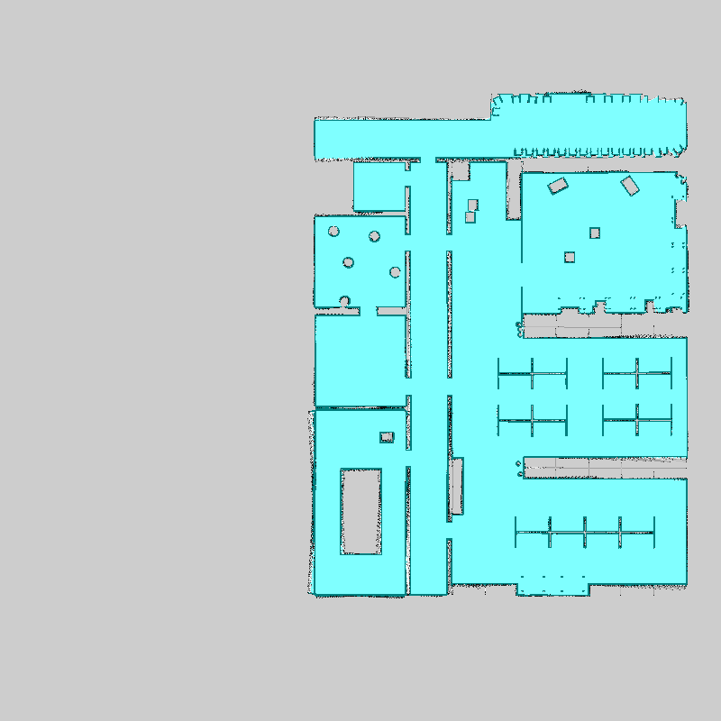
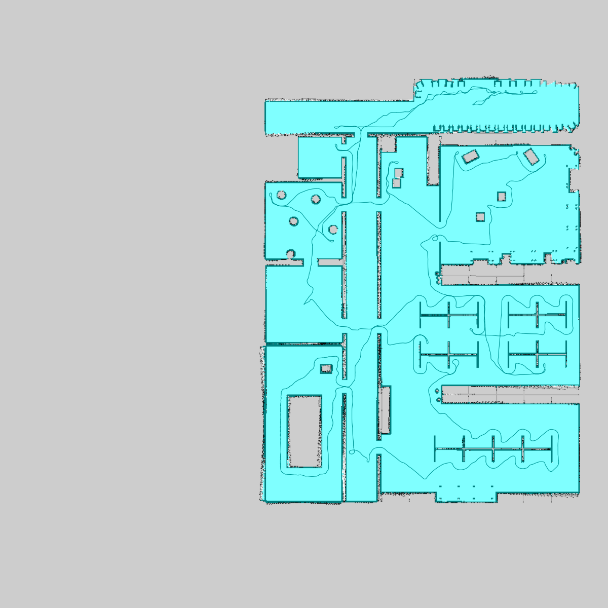

# Multirobot Collaborative SLAM Evaluation Report

**Bag ID:** bag_2026_02_17_16_03_58

**Experiment Date:** 2026-02-17

**Experiment Time:** 16:03:58

**Evaluation Date:** 2026-02-17

**Robots:**
`robot_0`

## Timing evaluation:

**Bag record time:** 1288537 ms

| Robot ID | Success | Last cmd (linear_x, angular_z) | Execution time |
|----------|---------|--------------------------------|----------------|
| `robot_0` | Yes | 0.000 m/s, 0.000 rad/s | **1281349 ms** (1281.349 s) |

**Exploration gap:** 0 ms

**Total time:** 1281349 ms

## Localization evaluation:

| Robot ID | Success | Ground truth | Final distance error | Distance MAE | Distance RMSE | Distance STD | Final yaw error | Yaw MAE | Yaw RMSE | Yaw STD |
|----------|---------|--------------|----------------------|--------------|---------------|--------------|-----------------|---------|----------|---------|
| `robot_0` | Yes | Yes | 0.03 m | 0.02 m | 0.03 m | 0.01 m | 0.00 rad | 0.01 rad | 0.02 rad | 0.02 rad |

### Localization results:

**Localization result:**

**Distance error:**

**Yaw error:**

## Mapping evaluation:

**Map resolution:** 0.05 m/pixel

**Dimension:** 800 x 800 cells (40.00 x 40.00 m)

**Map origin:** (-20.0, -20.0, 0.0)

**Explored area:** 507.68 m²

| Robot ID | Exploration area | Exploration percentage |
|----------|------------------|------------------------|
| `robot_0` | 507.68 m² | 100.00% |

**Mapping accuracy**: 0.9341 (4722737/5055825 compared cells)
| Quantity | Value |
|--------|-------|
| True Positives (TP)  | 232865 |
| True Negatives (TN)  | 4489872 |
| False Positives (FP) | 113885 |
| False Negatives (FN) | 219203 |

| Metric | Value |
|--------|-------|
| True Positive Rate (TPR)  | 0.5151105585885309 |
| True Negative Rate (TNR)  | 0.975262595310743 |
| False Positive Rate (FPR) | 0.024737404689257055 |
| False Negative Rate (FNR) | 0.48488944141146906 |
### Mapping results:

**Map ground truth:**

**Map result:**

**Map error:**

**Map confusion:**

Grey = not_evaluated, Green = TP, White = TN, Blue = FP, RED = FN

**Map robot_0:**

**Map merged:**

**Map merged with robot trajectories:**

