# Multirobot Collaborative SLAM Evaluation Report

**Bag ID:** bag_2026_02_18_11_04_25

**Experiment Date:** 2026-02-18

**Experiment Time:** 11:04:25

**Evaluation Date:** 2026-02-18

**Robots:**
`robot_0`
`robot_1`
`robot_2`

## Timing evaluation:

**Bag record time:** 499207 ms

| Robot ID | Success | Last cmd (linear_x, angular_z) | Execution time |
|----------|---------|--------------------------------|----------------|
| `robot_0` | No | 0.000 m/s, 0.000 rad/s | **490454 ms** (490.454 s) |
| `robot_1` | No | 0.220 m/s, 1.000 rad/s | **499207 ms** (499.207 s) |
| `robot_2` | No | 0.000 m/s, 0.000 rad/s | **492075 ms** (492.075 s) |

**Exploration gap:** 8754 ms

**Total time:** 499207 ms

## Localization evaluation:

| Robot ID | Success | Ground truth | Traveled distance | Final distance error | Distance MAE | Distance RMSE | Distance STD | Final yaw error | Yaw MAE | Yaw RMSE | Yaw STD |
|----------|---------|--------------|-------------------|----------------------|--------------|---------------|--------------|-----------------|---------|----------|---------|
| `robot_0` | No | Yes | 78.12 m | 0.14 m | 0.05 m | 0.06 m | 0.04 m | 0.00 rad | 0.01 rad | 0.02 rad | 0.02 rad |
| `robot_1` | No | Yes | 58.69 m | 0.24 m | 0.09 m | 0.14 m | 0.11 m | 0.03 rad | 0.01 rad | 0.02 rad | 0.02 rad |
| `robot_2` | No | Yes | 79.12 m | 0.03 m | 0.01 m | 0.01 m | 0.01 m | 0.00 rad | 0.01 rad | 0.02 rad | 0.02 rad |

### Localization results:

**Localization result:**

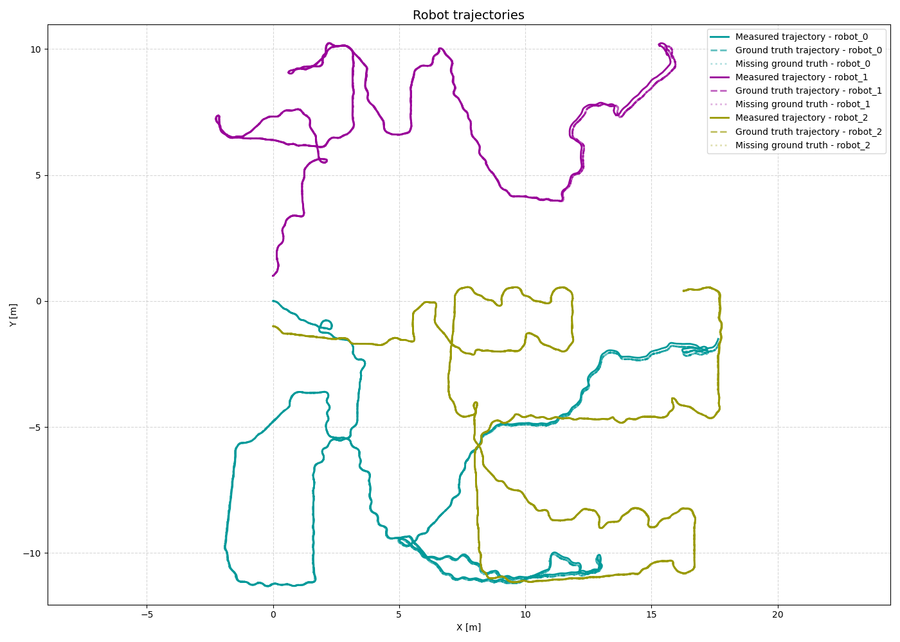

**Distance error:**

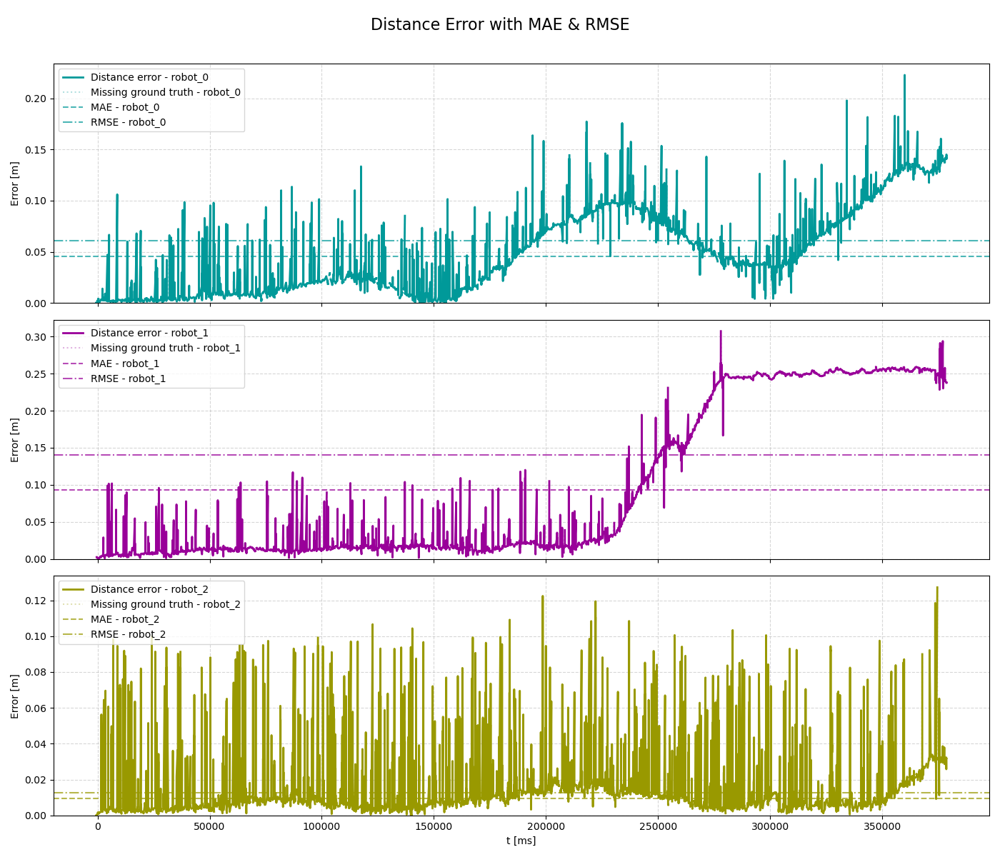

**Yaw error:**

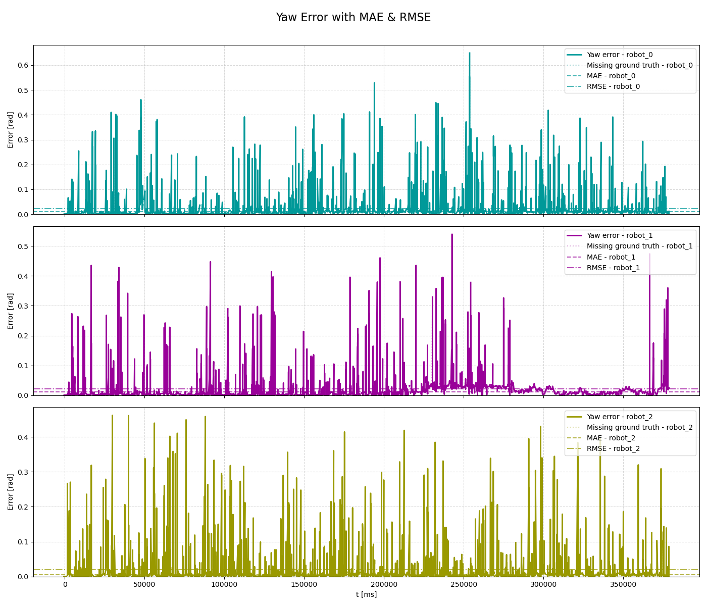

## Mapping evaluation:

**Map resolution:** 0.05 m/pixel

**Dimension:** 800 x 800 cells (40.00 x 40.00 m)

**Map origin:** (-20.0, -20.0, 0.0)

**Explored area:** 449.59 m²

**Explored area ratio:** 95.79%

| Robot ID | Exploration area | Exploration percentage |
|----------|------------------|------------------------|
| `robot_0` | 309.71 m² | 68.89% |
| `robot_1` | 223.15 m² | 49.63% |
| `robot_2` | 299.31 m² | 66.57% |
| `robot_0`, `robot_1` | 433.59 m² | 96.44% |
| `robot_0`, `robot_2` | 358.25 m² | 79.68% |
| `robot_1`, `robot_2` | 397.55 m² | 88.42% |
| `robot_0`, `robot_1`, `robot_2` | 448.40 m² | 100% |

**Mapping accuracy**: 0.9253 (4142893/4477500 compared cells)
| Quantity | Value |
|--------|-------|
| True Positives (TP)  | 212316 |
| True Negatives (TN)  | 3930577 |
| False Positives (FP) | 111234 |
| False Negatives (FN) | 223373 |

| Metric | Value |
|--------|-------|
| True Positive Rate (TPR)  | 0.48731090296059804 |
| True Negative Rate (TNR)  | 0.9724791683727914 |
| False Positive Rate (FPR) | 0.027520831627208694 |
| False Negative Rate (FNR) | 0.5126890970394019 |
### Mapping results:

**Map ground truth:**

**Map result:**

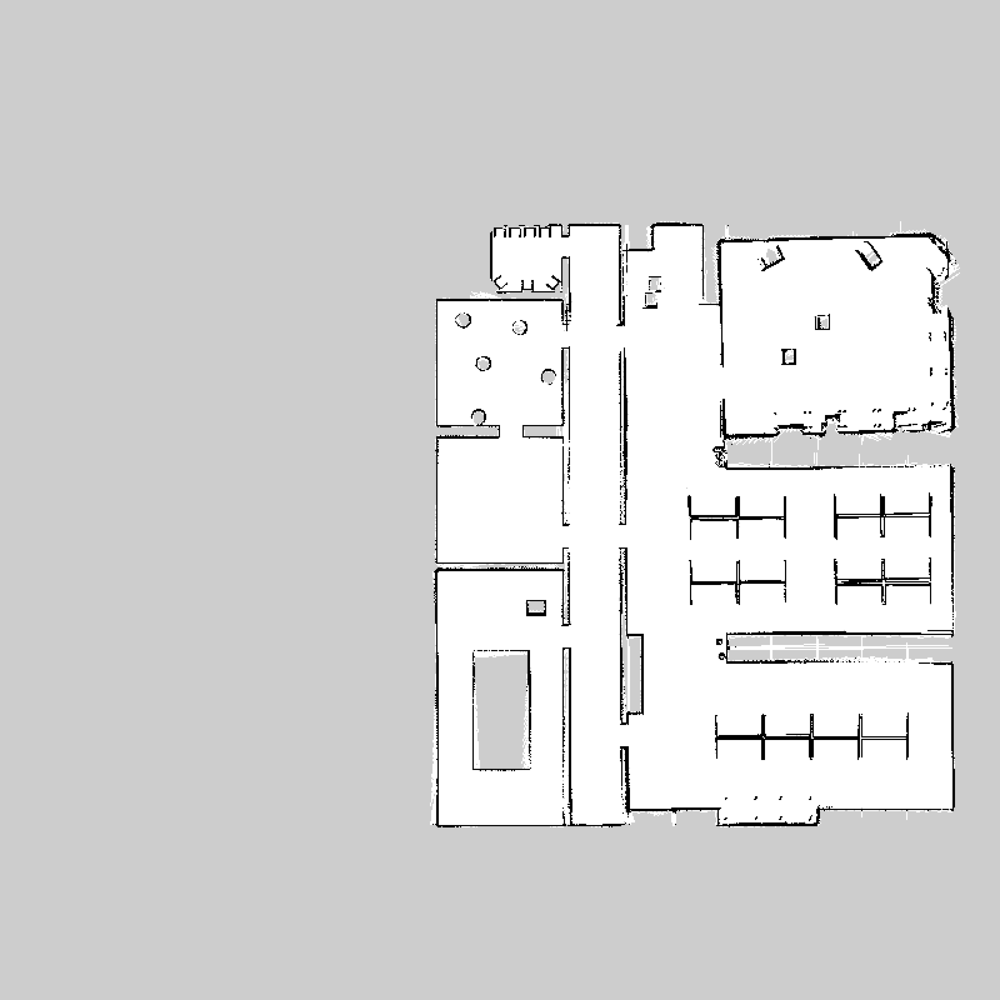

**Map error:**

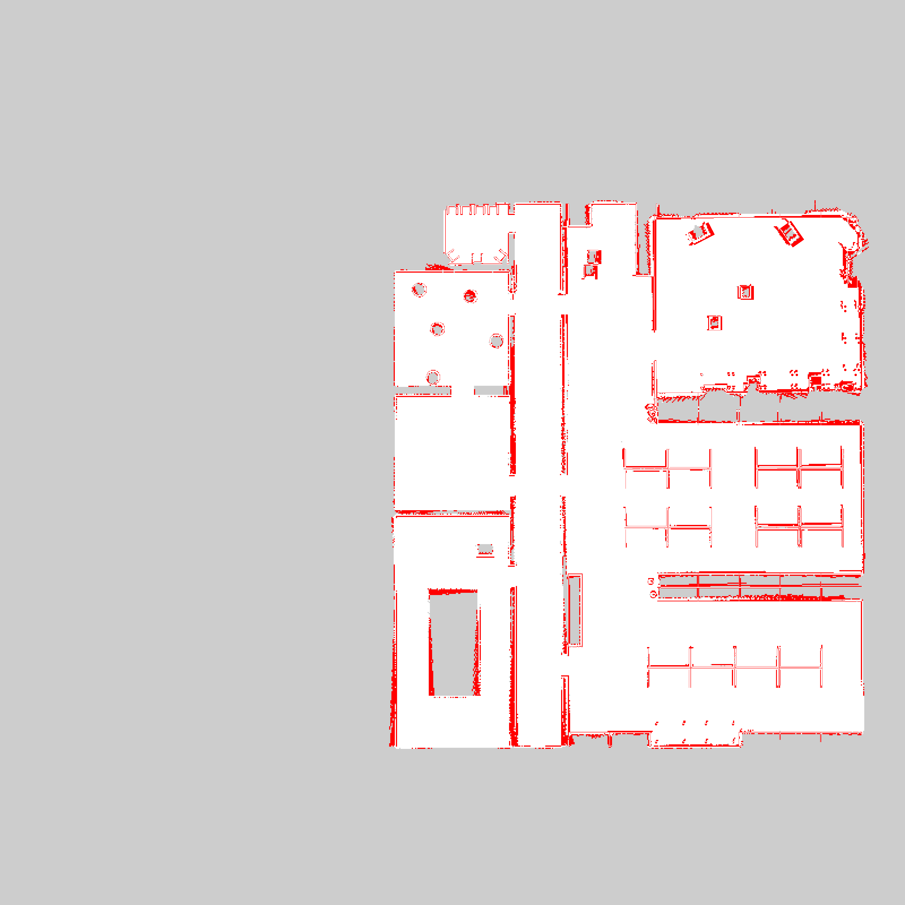

**Map confusion:**

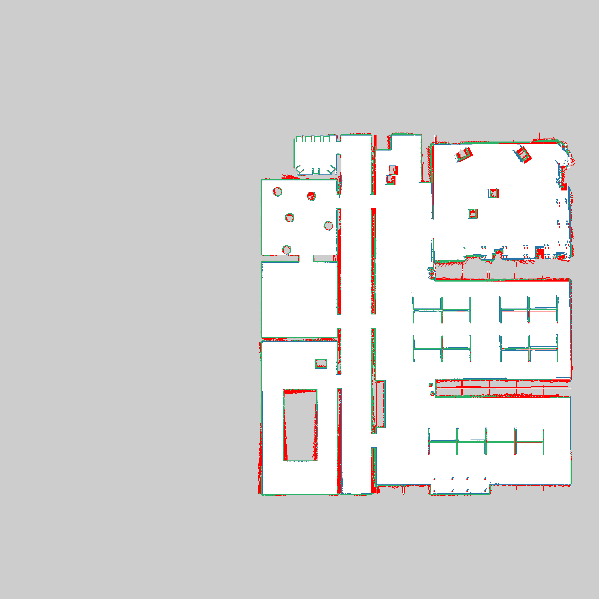

Grey = not_evaluated, Green = TP, White = TN, Blue = FP, RED = FN

**Map robot_0:**

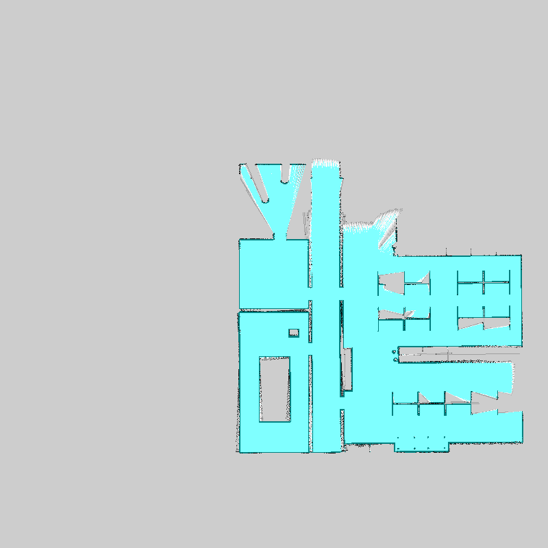

**Map robot_1:**

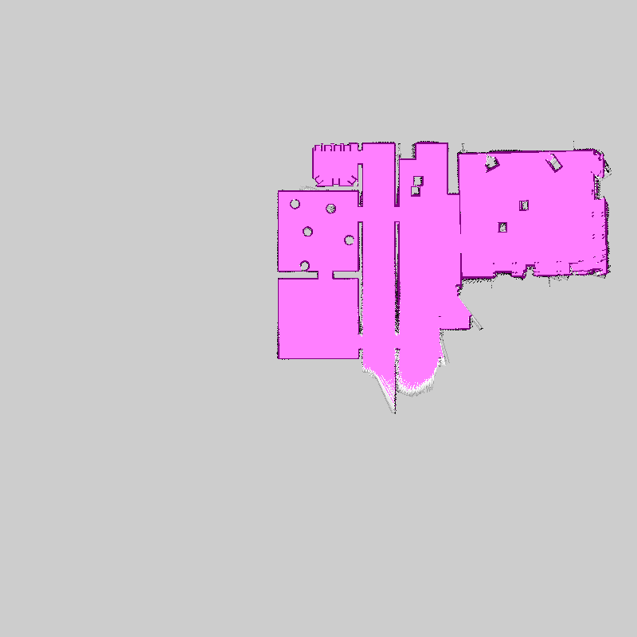

**Map robot_2:**

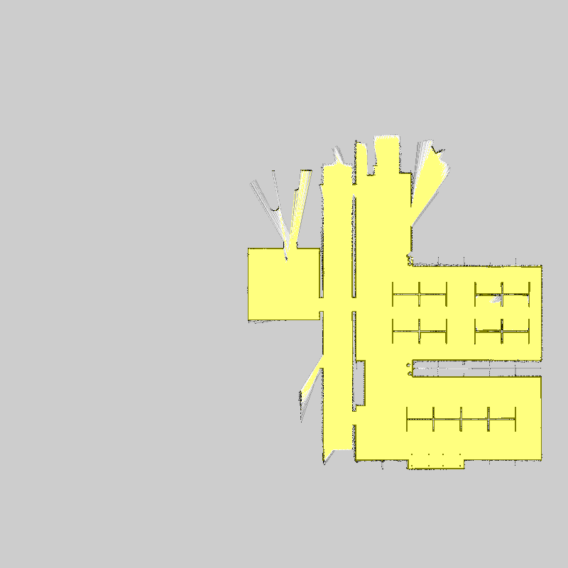

**Map merged:**

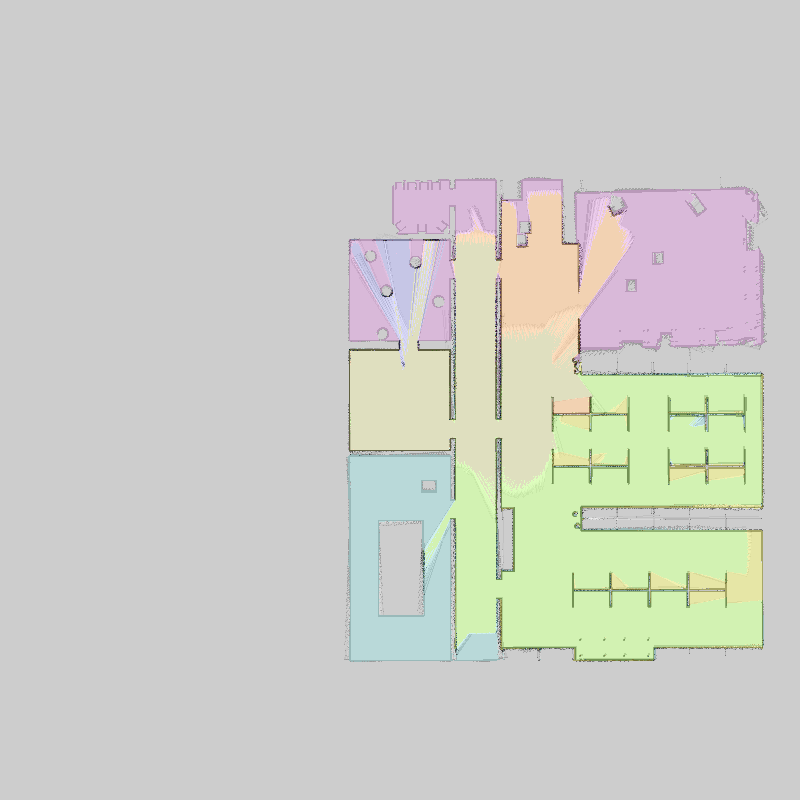

**Map merged with robot trajectories:**

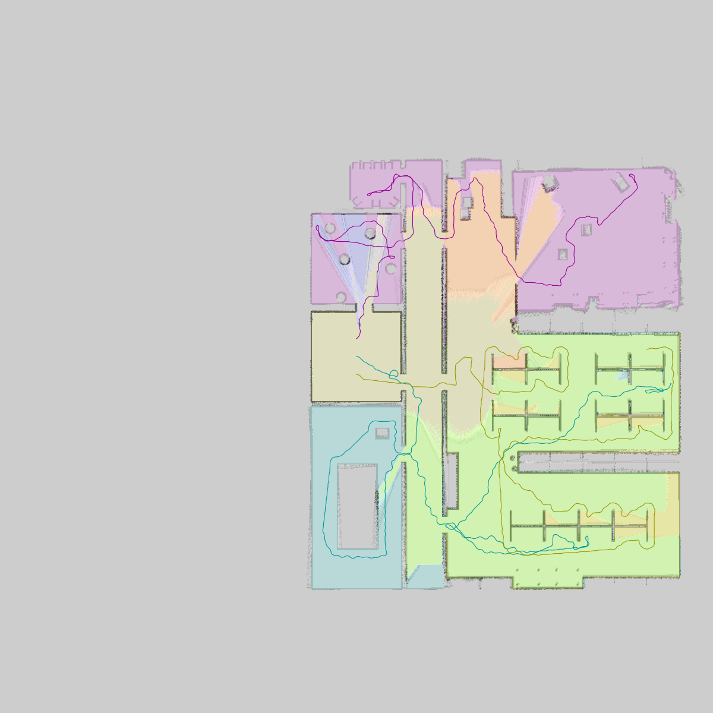

