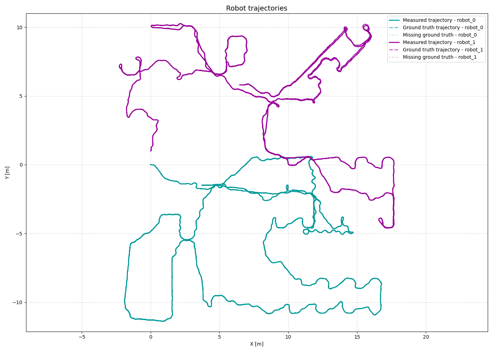
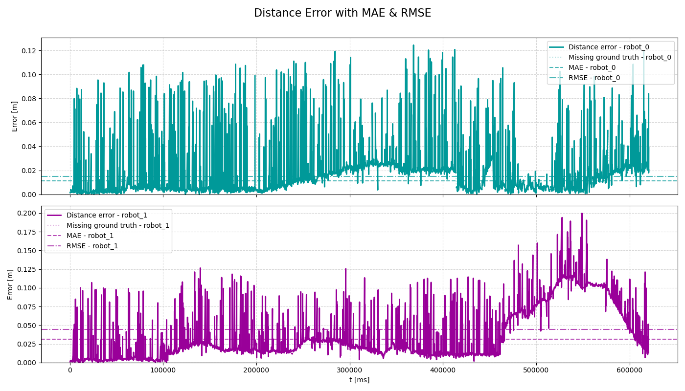
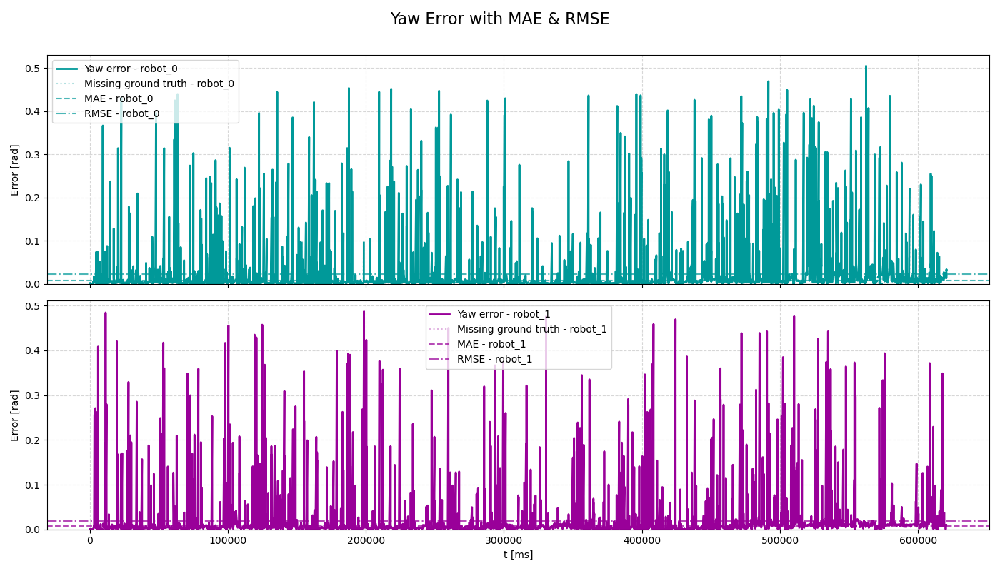
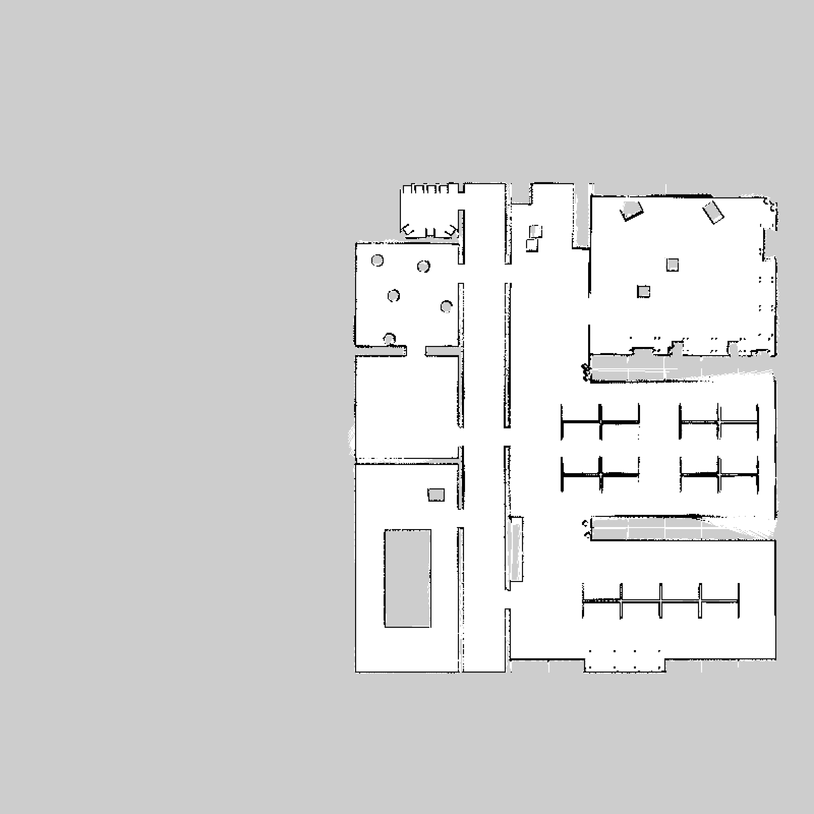
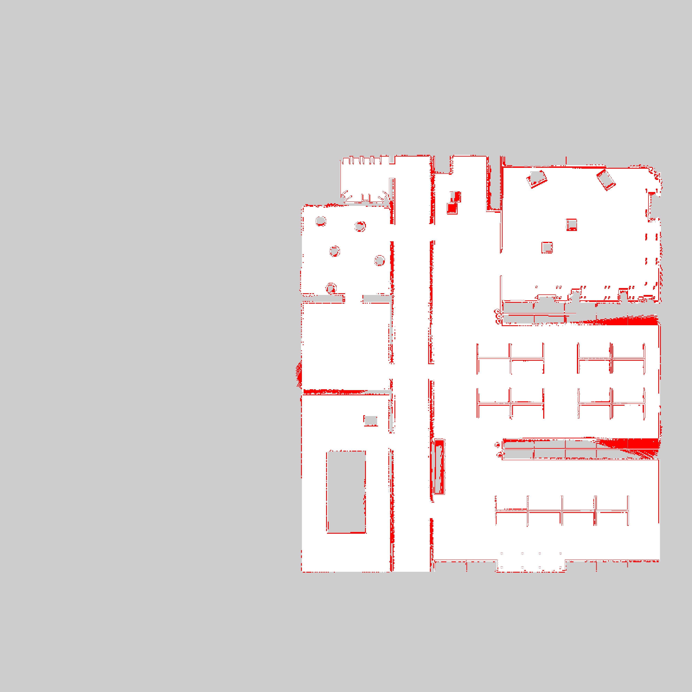
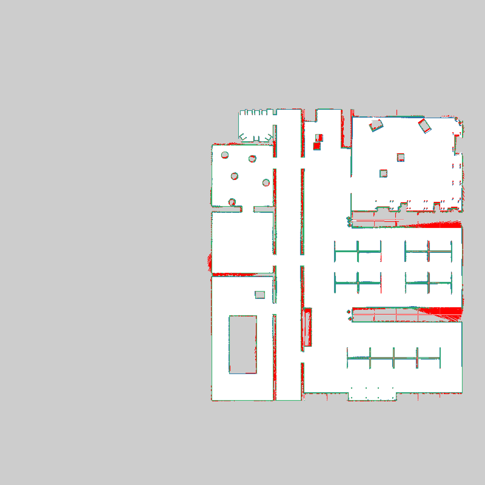
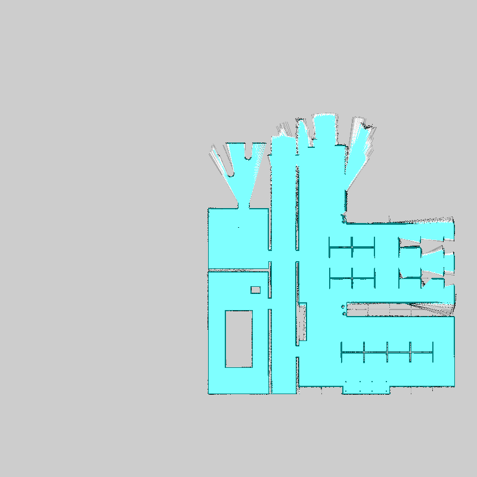
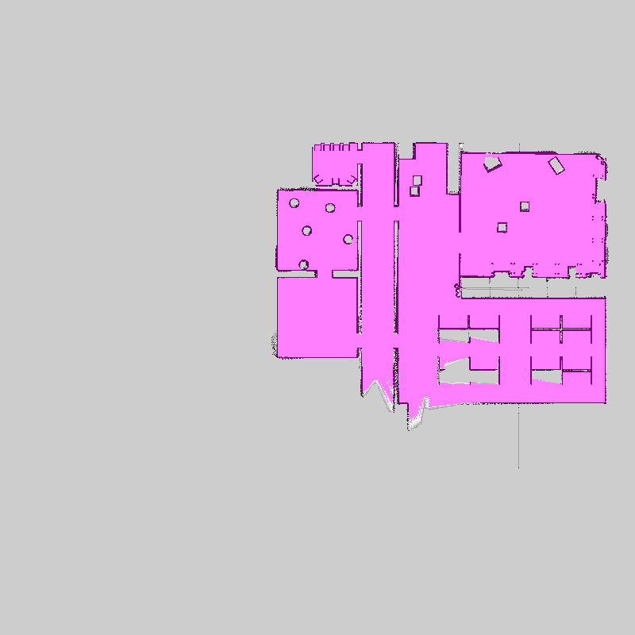
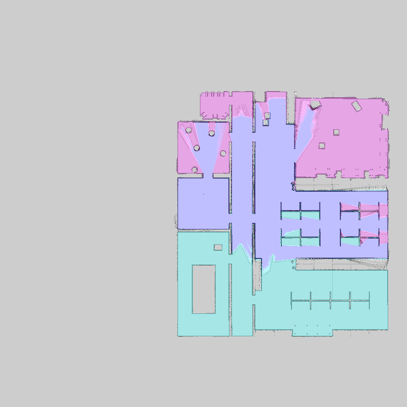
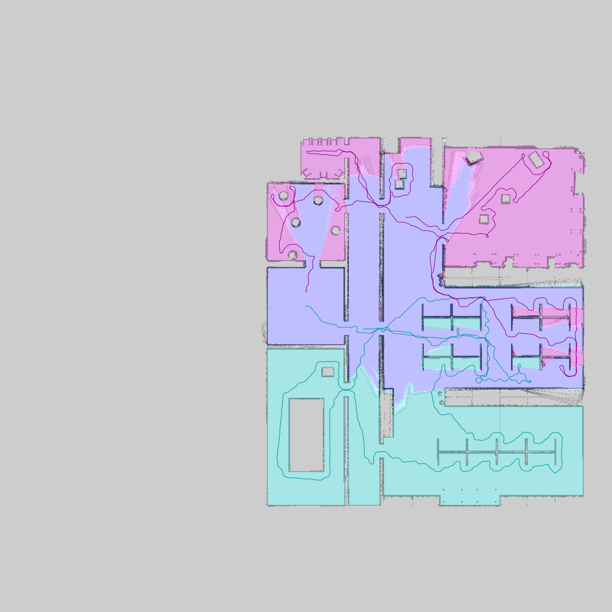

# Multirobot Collaborative SLAM Evaluation Report

**Bag ID:** bag_2026_02_18_12_46_28

**Experiment Date:** 2026-02-18

**Experiment Time:** 12:46:28

**Evaluation Date:** 2026-02-18

**Robots:**
`robot_0`
`robot_1`

## Timing evaluation:

**Bag record time:** 620525 ms

| Robot ID | Success | Last cmd (linear_x, angular_z) | Execution time |
|----------|---------|--------------------------------|----------------|
| `robot_0` | No | 0.220 m/s, -0.105 rad/s | **620525 ms** (620.525 s) |
| `robot_1` | No | 0.220 m/s, 0.592 rad/s | **620126 ms** (620.126 s) |

**Exploration gap:** 398 ms

**Total time:** 620525 ms

## Localization evaluation:

| Robot ID | Success | Ground truth | Traveled distance | Final distance error | Distance MAE | Distance RMSE | Distance STD | Final yaw error | Yaw MAE | Yaw RMSE | Yaw STD |
|----------|---------|--------------|-------------------|----------------------|--------------|---------------|--------------|-----------------|---------|----------|---------|
| `robot_0` | No | Yes | 123.03 m | 0.02 m | 0.01 m | 0.01 m | 0.01 m | 0.03 rad | 0.01 rad | 0.02 rad | 0.02 rad |
| `robot_1` | No | Yes | 124.95 m | 0.01 m | 0.03 m | 0.04 m | 0.03 m | 0.01 rad | 0.01 rad | 0.02 rad | 0.02 rad |

### Localization results:

**Localization result:**

**Distance error:**

**Yaw error:**

## Mapping evaluation:

**Map resolution:** 0.05 m/pixel

**Dimension:** 800 x 800 cells (40.00 x 40.00 m)

**Map origin:** (-20.0, -20.0, 0.0)

**Explored area:** 445.64 m²

**Explored area ratio:** 96.36%

| Robot ID | Exploration area | Exploration percentage |
|----------|------------------|------------------------|
| `robot_0` | 349.67 m² | 78.46% |
| `robot_1` | 286.67 m² | 64.33% |
| `robot_0`, `robot_1` | 444.35 m² | 100% |

**Mapping accuracy**: 0.9356 (4153694/4439700 compared cells)
| Quantity | Value |
|--------|-------|
| True Positives (TP)  | 199533 |
| True Negatives (TN)  | 3954161 |
| False Positives (FP) | 89717 |
| False Negatives (FN) | 196289 |

| Metric | Value |
|--------|-------|
| True Positive Rate (TPR)  | 0.5040978015370545 |
| True Negative Rate (TNR)  | 0.9778141180322453 |
| False Positive Rate (FPR) | 0.022185881967754714 |
| False Negative Rate (FNR) | 0.4959021984629455 |
### Mapping results:

**Map ground truth:**

**Map result:**

**Map error:**

**Map confusion:**

Grey = not_evaluated, Green = TP, White = TN, Blue = FP, RED = FN

**Map robot_0:**

**Map robot_1:**

**Map merged:**

**Map merged with robot trajectories:**

