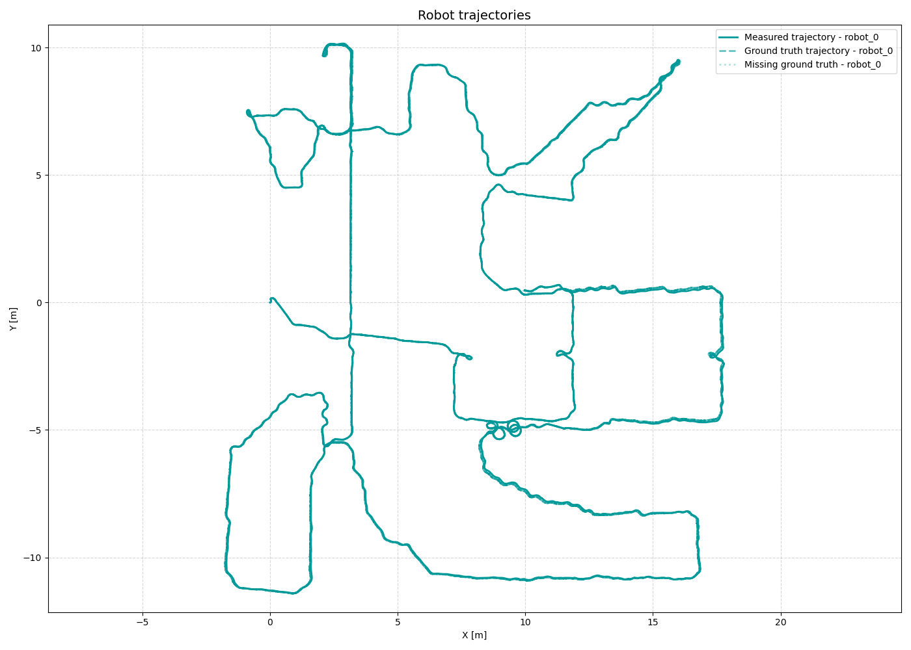
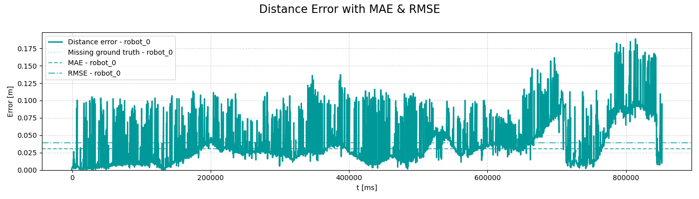
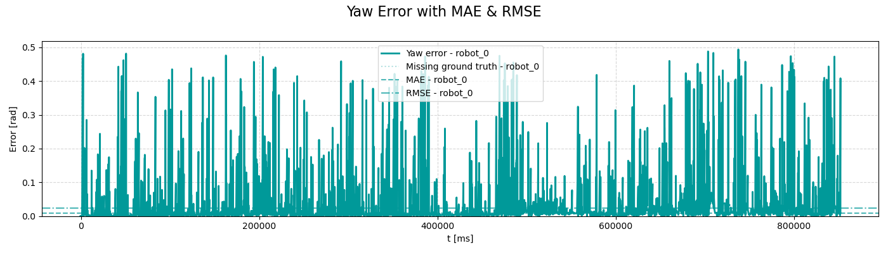
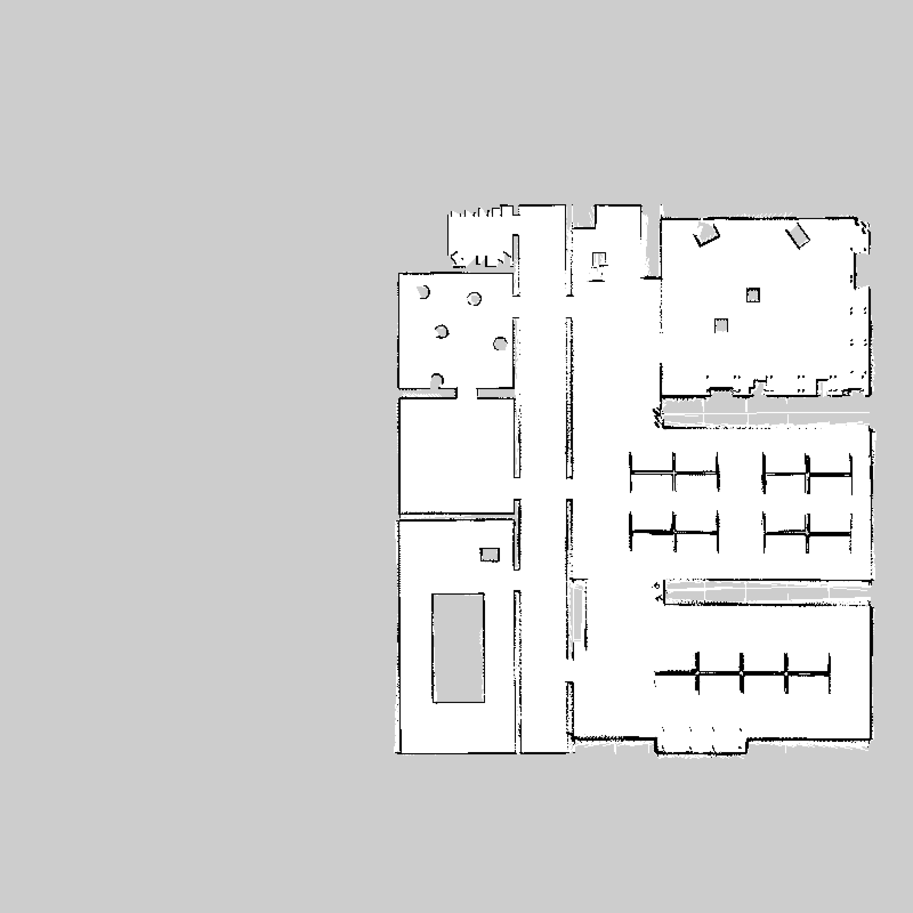
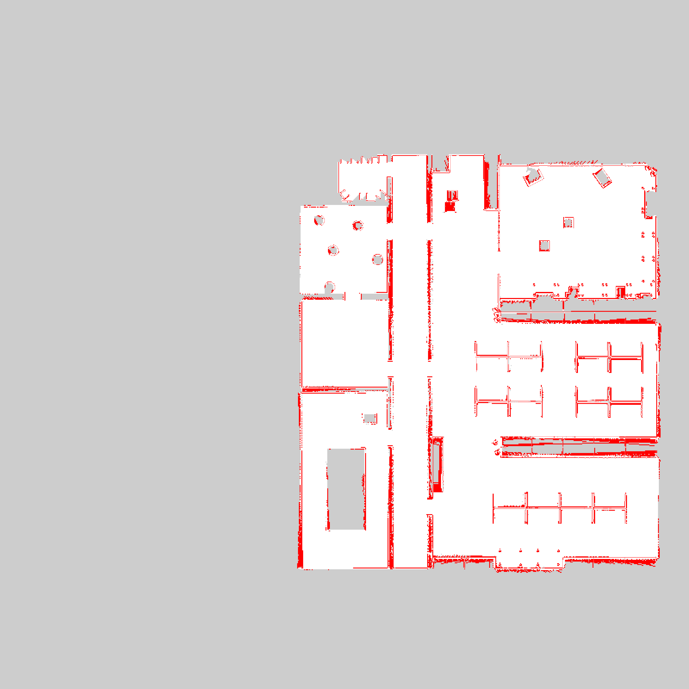
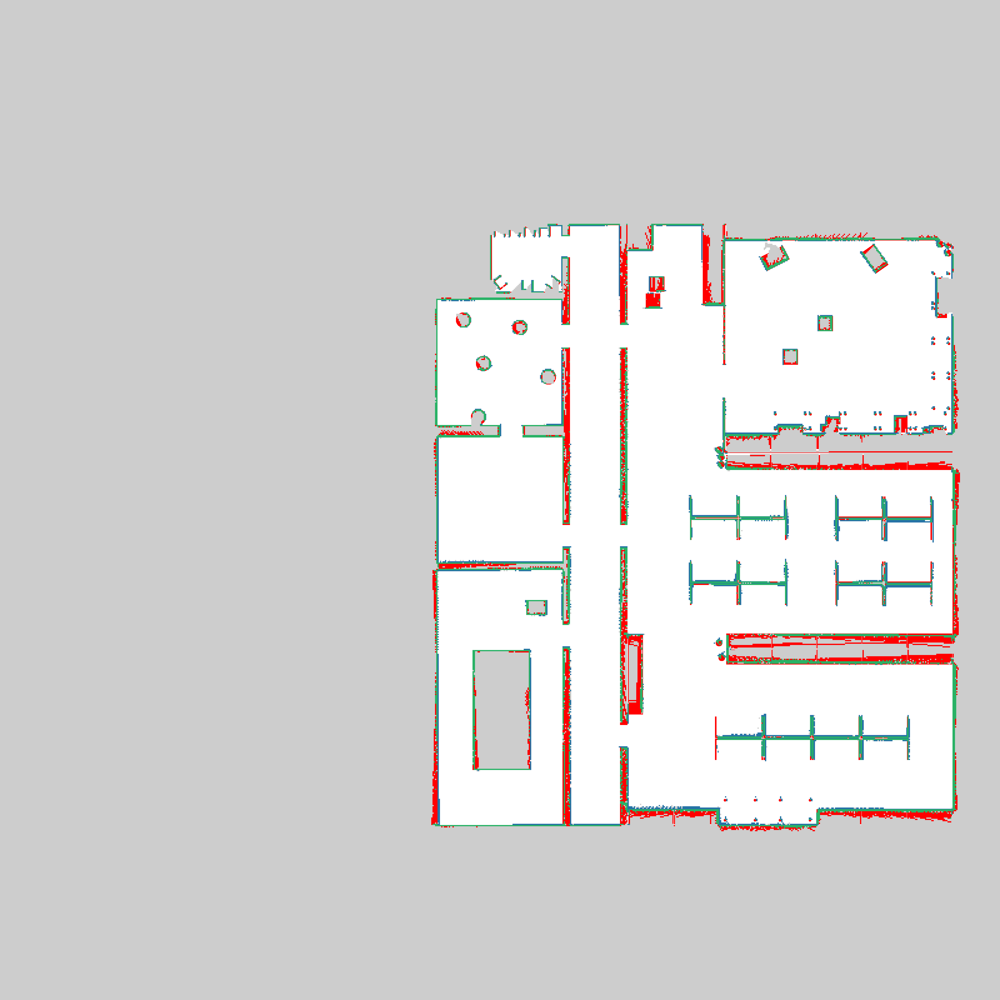
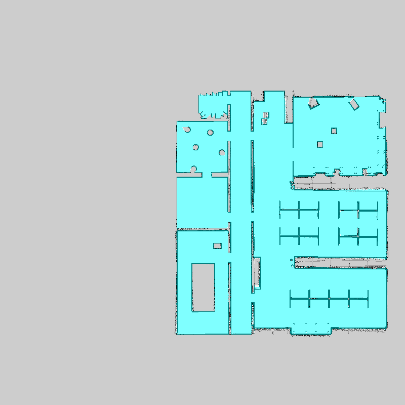
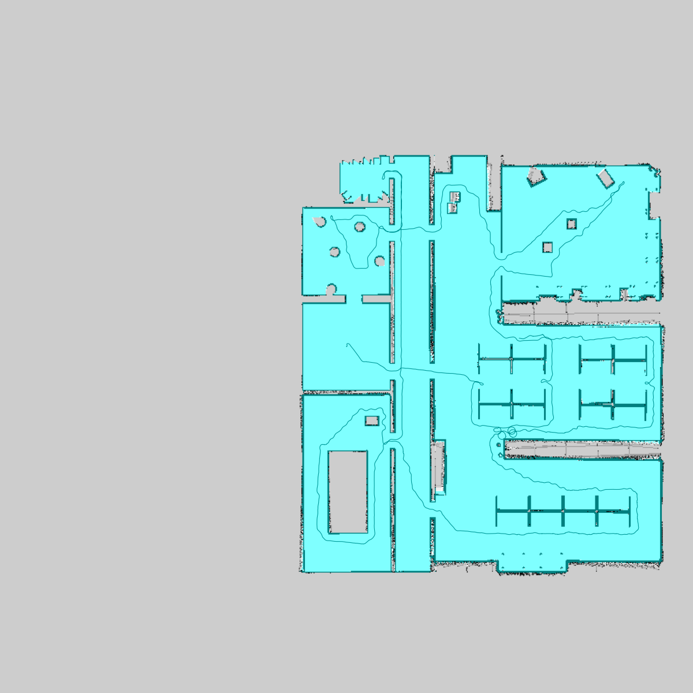

# Multirobot Collaborative SLAM Evaluation Report

**Bag ID:** bag_2026_02_18_16_53_19

**Experiment Date:** 2026-02-18

**Experiment Time:** 16:53:19

**Evaluation Date:** 2026-02-18

**Robots:**
`robot_0`

## Timing evaluation:

**Bag record time:** 1533600 ms

| Robot ID | Success | Last cmd (linear_x, angular_z) | Execution time |
|----------|---------|--------------------------------|----------------|
| `robot_0` | No | 0.000 m/s, 0.000 rad/s | **948010 ms** (748.010 s) |

**Exploration gap:** 0 ms

**Total time:** 948010 ms

## Localization evaluation:

| Robot ID | Success | Ground truth | Traveled distance | Final distance error | Distance MAE | Distance RMSE | Distance STD | Final yaw error | Yaw MAE | Yaw RMSE | Yaw STD |
|----------|---------|--------------|-------------------|----------------------|--------------|---------------|--------------|-----------------|---------|----------|---------|
| `robot_0` | No | Yes | 181.32 m | 0.01 m | 0.03 m | 0.04 m | 0.02 m | 0.01 rad | 0.01 rad | 0.02 rad | 0.02 rad |

### Localization results:

**Localization result:**

**Distance error:**

**Yaw error:**

## Mapping evaluation:

**Map resolution:** 0.05 m/pixel

**Dimension:** 800 x 800 cells (40.00 x 40.00 m)

**Map origin:** (-20.0, -20.0, 0.0)

**Explored area:** 450.93 m²

**Explored area ratio:** 95.91%

| Robot ID | Exploration area | Exploration percentage |
|----------|------------------|------------------------|
| `robot_0` | 448.58 m² | 99.48% |

**Mapping accuracy**: 0.9243 (4146607/4486175 compared cells)
| Quantity | Value |
|--------|-------|
| True Positives (TP)  | 210880 |
| True Negatives (TN)  | 3935727 |
| False Positives (FP) | 97370 |
| False Negatives (FN) | 242198 |

| Metric | Value |
|--------|-------|
| True Positive Rate (TPR)  | 0.46543862204741787 |
| True Negative Rate (TNR)  | 0.9758572630412807 |
| False Positive Rate (FPR) | 0.024142736958719317 |
| False Negative Rate (FNR) | 0.5345613779525821 |
### Mapping results:

**Map ground truth:**

**Map result:**

**Map error:**

**Map confusion:**

Grey = not_evaluated, Green = TP, White = TN, Blue = FP, RED = FN

**Map robot_0:**

**Map merged:**

**Map merged with robot trajectories:**

