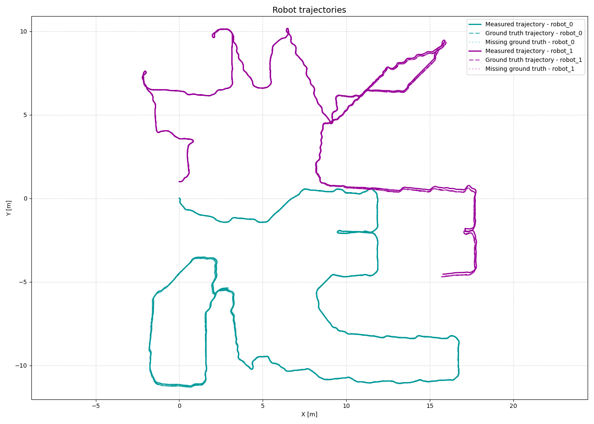
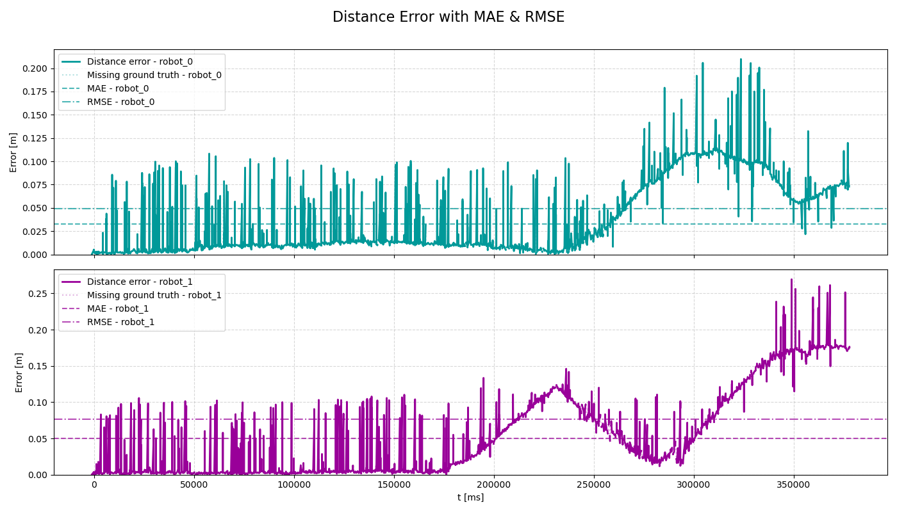
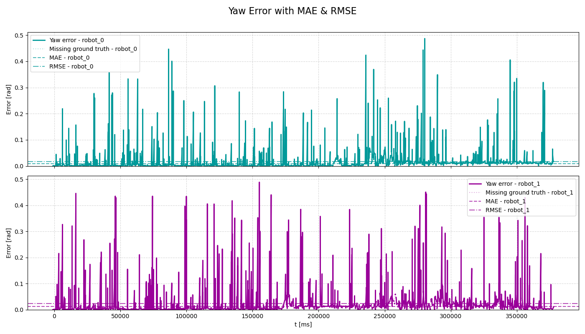
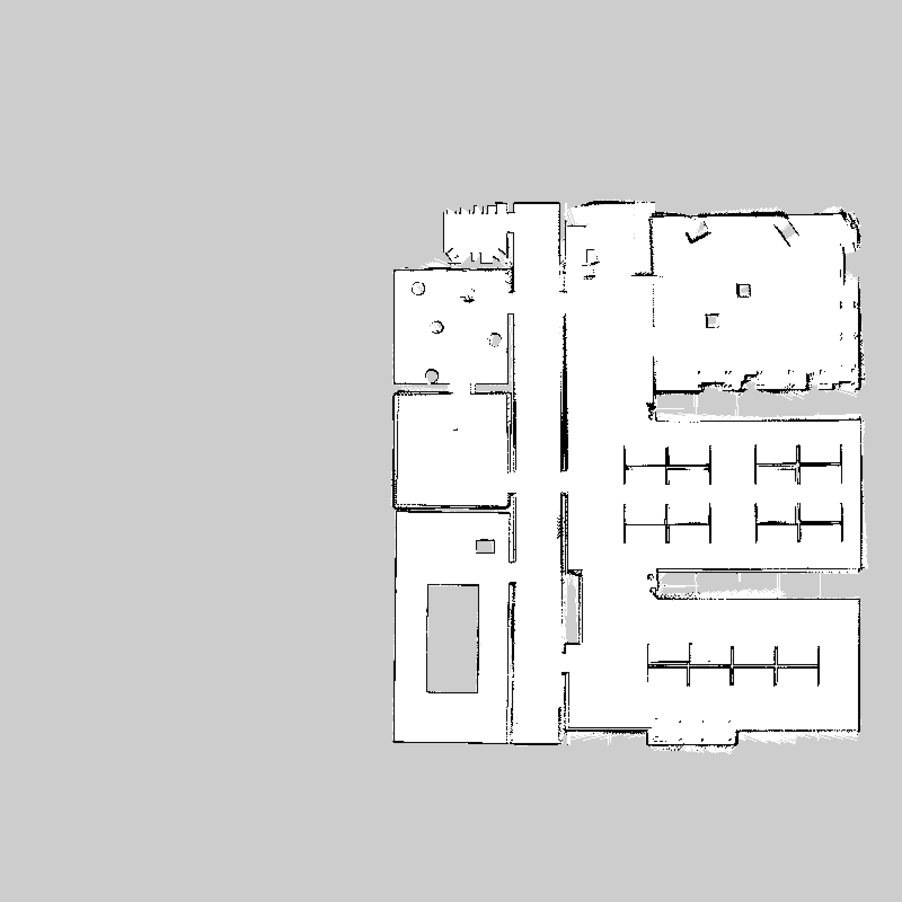
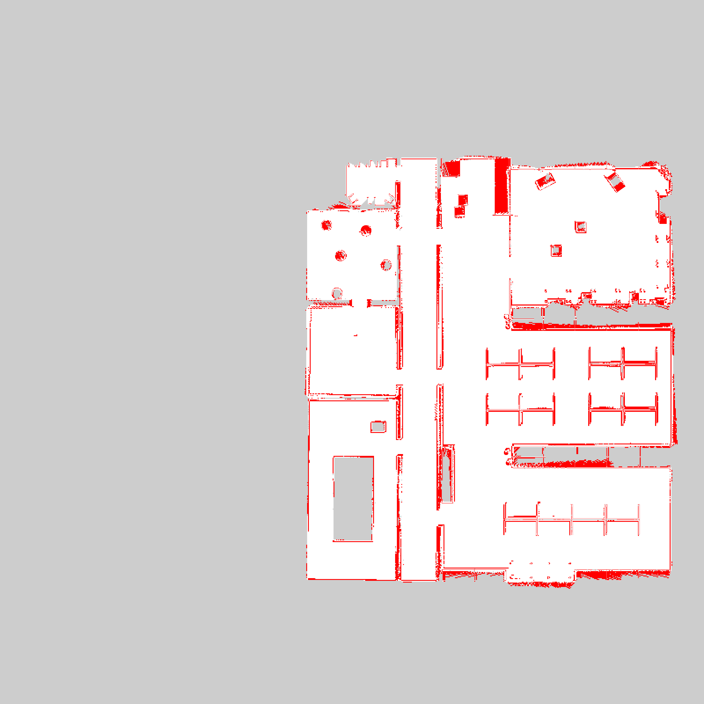
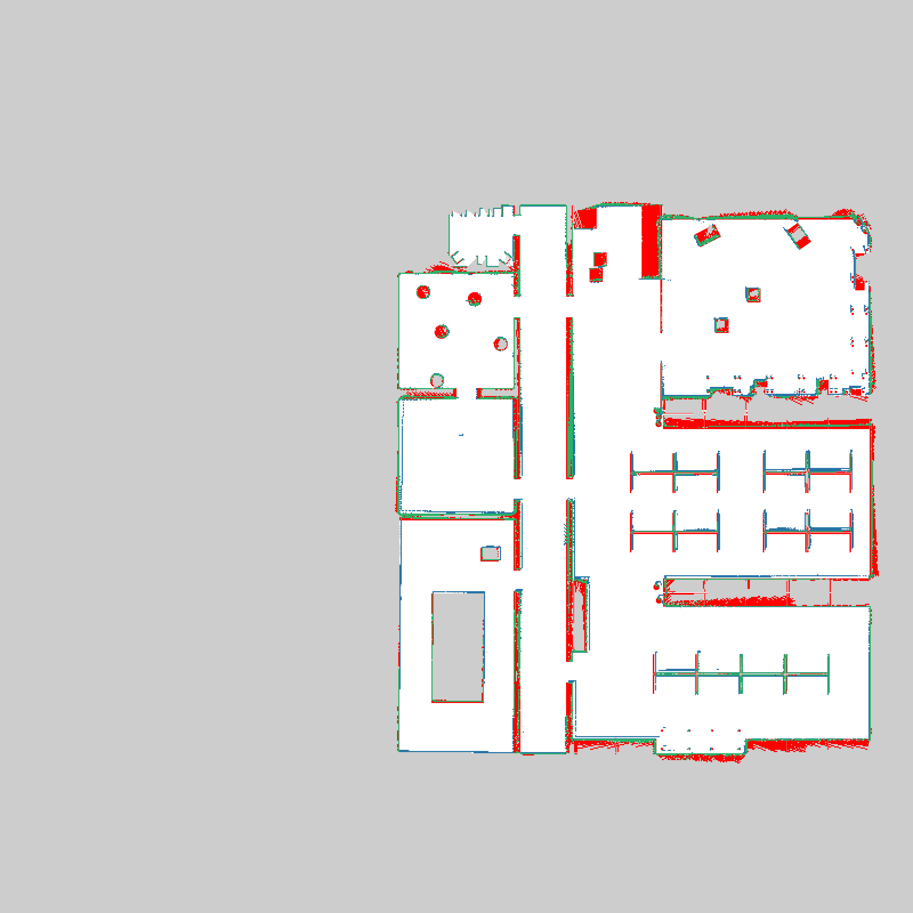
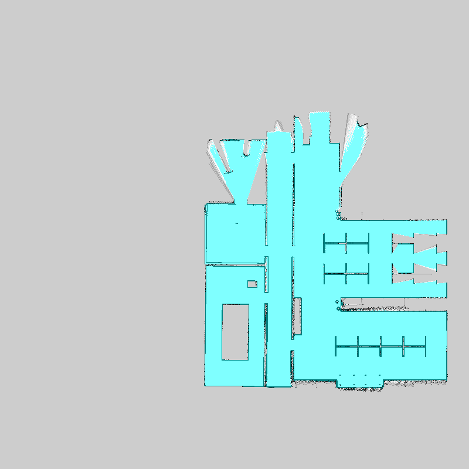
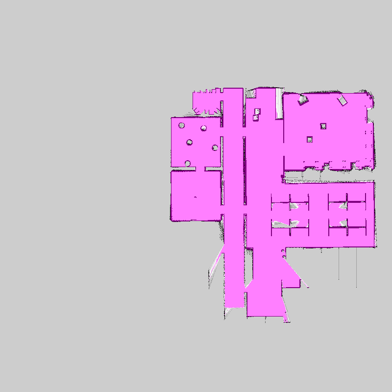
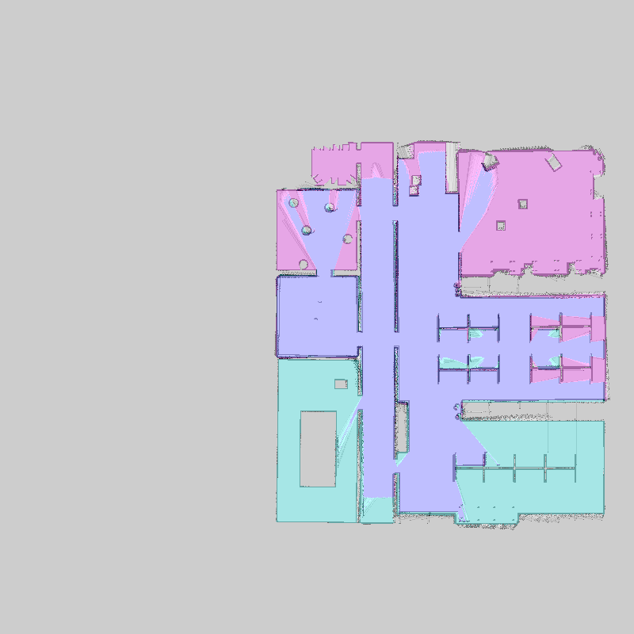
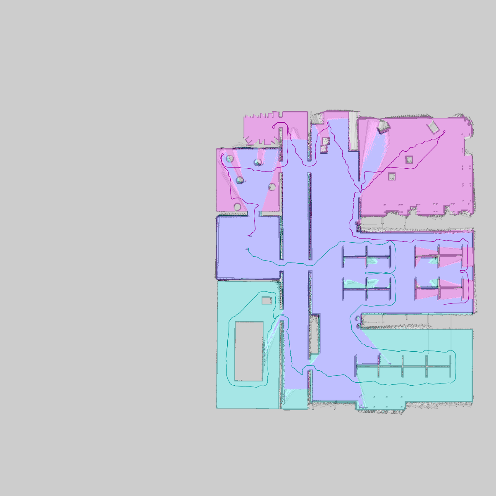

# Multirobot Collaborative SLAM Evaluation Report

**Bag ID:** bag_2026_02_18_20_21_25

**Experiment Date:** 2026-02-18

**Experiment Time:** 20:21:25

**Evaluation Date:** 2026-02-18

**Robots:**
`robot_0`
`robot_1`

## Timing evaluation:

**Bag record time:** 675452 ms

| Robot ID | Success | Last cmd (linear_x, angular_z) | Execution time |
|----------|---------|--------------------------------|----------------|
| `robot_0` | No | 0.000 m/s, 0.000 rad/s | **415214 ms** (415.214 s) |
| `robot_1` | No | 0.000 m/s, 0.000 rad/s | **478412 ms** (478.412 s) |

**Exploration gap:** 63198 ms

**Total time:** 478412 ms

## Localization evaluation:

| Robot ID | Success | Ground truth | Traveled distance | Final distance error | Distance MAE | Distance RMSE | Distance STD | Final yaw error | Yaw MAE | Yaw RMSE | Yaw STD |
|----------|---------|--------------|-------------------|----------------------|--------------|---------------|--------------|-----------------|---------|----------|---------|
| `robot_0` | No | Yes | 82.01 m | 0.07 m | 0.03 m | 0.05 m | 0.04 m | 0.02 rad | 0.01 rad | 0.02 rad | 0.02 rad |
| `robot_1` | No | Yes | 79.56 m | 0.18 m | 0.05 m | 0.08 m | 0.06 m | 0.01 rad | 0.01 rad | 0.02 rad | 0.02 rad |

### Localization results:

**Localization result:**

**Distance error:**

**Yaw error:**

## Mapping evaluation:

**Map resolution:** 0.05 m/pixel

**Dimension:** 800 x 800 cells (40.00 x 40.00 m)

**Map origin:** (-20.0, -20.0, 0.0)

**Explored area:** 453.65 m²

**Explored area ratio:** 95.43%

| Robot ID | Exploration area | Exploration percentage |
|----------|------------------|------------------------|
| `robot_0` | 346.64 m² | 76.41% |
| `robot_1` | 346.26 m² | 76.33% |
| `robot_0`, `robot_1` | 453.65 m² | 100.00% |

**Mapping accuracy**: 0.9098 (4108625/4516175 compared cells)
| Quantity | Value |
|--------|-------|
| True Positives (TP)  | 192857 |
| True Negatives (TN)  | 3915768 |
| False Positives (FP) | 116868 |
| False Negatives (FN) | 290682 |

| Metric | Value |
|--------|-------|
| True Positive Rate (TPR)  | 0.3988447674334438 |
| True Negative Rate (TNR)  | 0.9710194522887758 |
| False Positive Rate (FPR) | 0.028980547711224124 |
| False Negative Rate (FNR) | 0.6011552325665561 |
### Mapping results:

**Map ground truth:**

**Map result:**

**Map error:**

**Map confusion:**

Grey = not_evaluated, Green = TP, White = TN, Blue = FP, RED = FN

**Map robot_0:**

**Map robot_1:**

**Map merged:**

**Map merged with robot trajectories:**

