# Multirobot Collaborative SLAM Evaluation Report

**Bag ID:** bag_2026_02_19_10_38_28

**Experiment Date:** 2026-02-19

**Experiment Time:** 10:38:28

**Evaluation Date:** 2026-02-19

**Robots:**
`robot_0`
`robot_1`
`robot_2`

## Timing evaluation:

**Bag record time:** 341016 ms

| Robot ID | Success | Last cmd (linear_x, angular_z) | Execution time |
|----------|---------|--------------------------------|----------------|
| `robot_0` | No | 0.220 m/s, -1.000 rad/s | **340419 ms** (340.419 s) |
| `robot_1` | No | 0.220 m/s, -0.248 rad/s | **341016 ms** (341.016 s) |
| `robot_2` | No | 0.220 m/s, 1.000 rad/s | **341016 ms** (341.016 s) |

**Exploration gap:** 597 ms

**Total time:** 341016 ms

## Localization evaluation:

| Robot ID | Success | Ground truth | Traveled distance | Final distance error | Distance MAE | Distance RMSE | Distance STD | Final yaw error | Yaw MAE | Yaw RMSE | Yaw STD |
|----------|---------|--------------|-------------------|----------------------|--------------|---------------|--------------|-----------------|---------|----------|---------|
| `robot_0` | No | Yes | 71.28 m | 0.06 m | 0.05 m | 0.07 m | 0.05 m | 0.01 rad | 0.01 rad | 0.02 rad | 0.02 rad |
| `robot_1` | No | Yes | 71.92 m | 0.07 m | 0.05 m | 0.07 m | 0.04 m | 0.01 rad | 0.01 rad | 0.03 rad | 0.02 rad |
| `robot_2` | No | Yes | 71.62 m | 0.08 m | 0.03 m | 0.05 m | 0.04 m | 0.01 rad | 0.01 rad | 0.02 rad | 0.02 rad |

### Localization results:

**Localization result:**

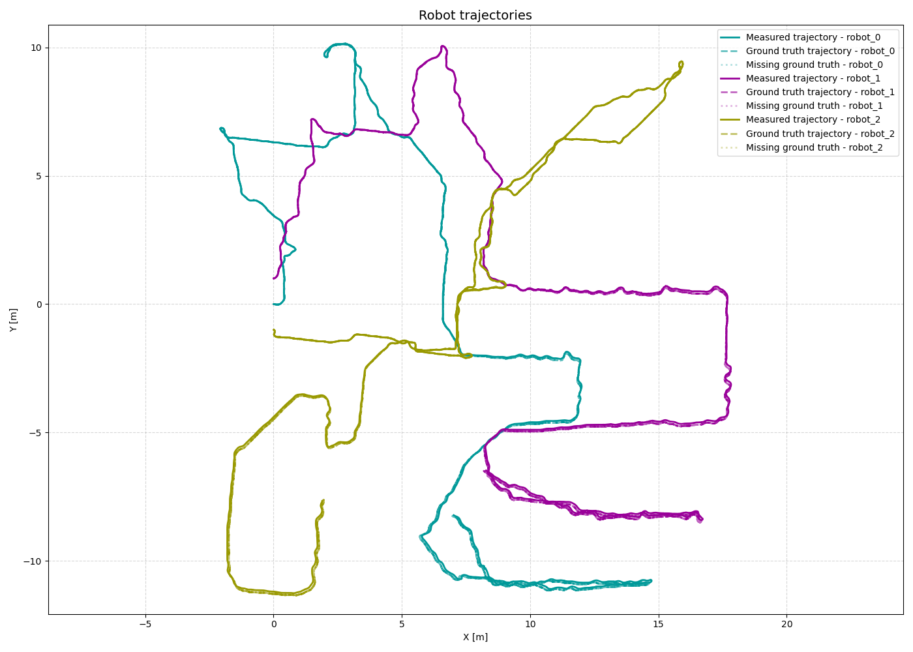

**Distance error:**

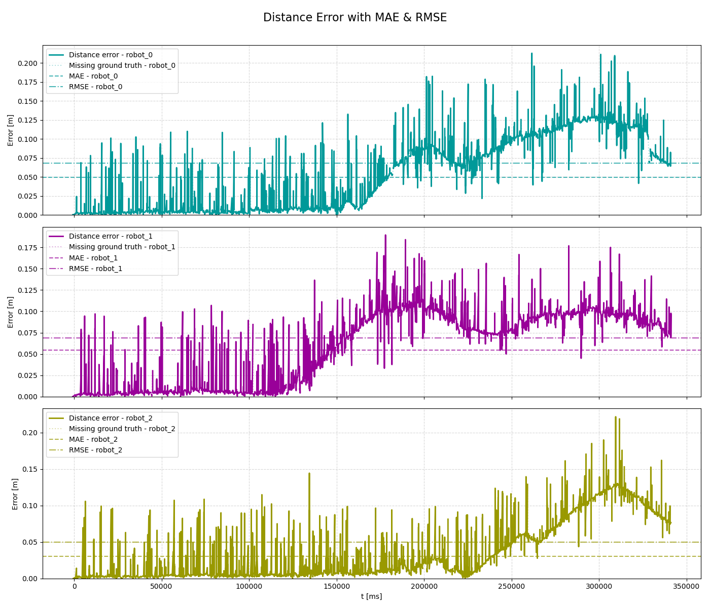

**Yaw error:**

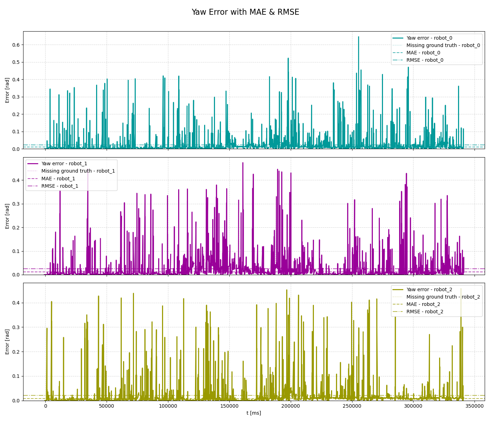

## Mapping evaluation:

**Map resolution:** 0.05 m/pixel

**Dimension:** 800 x 800 cells (40.00 x 40.00 m)

**Map origin:** (-20.0, -20.0, 0.0)

**Explored area:** 449.12 m²

**Explored area ratio:** 95.64%

| Robot ID | Exploration area | Exploration percentage |
|----------|------------------|------------------------|
| `robot_0` | 345.05 m² | 76.83% |
| `robot_1` | 339.35 m² | 75.56% |
| `robot_2` | 325.75 m² | 72.53% |
| `robot_0`, `robot_1` | 385.34 m² | 85.80% |
| `robot_0`, `robot_2` | 429.59 m² | 95.65% |
| `robot_1`, `robot_2` | 415.13 m² | 92.43% |
| `robot_0`, `robot_1`, `robot_2` | 449.12 m² | 100.00% |

**Mapping accuracy**: 0.9209 (4118083/4471600 compared cells)
| Quantity | Value |
|--------|-------|
| True Positives (TP)  | 193360 |
| True Negatives (TN)  | 3924723 |
| False Positives (FP) | 113665 |
| False Negatives (FN) | 239852 |

| Metric | Value |
|--------|-------|
| True Positive Rate (TPR)  | 0.44634035991616117 |
| True Negative Rate (TNR)  | 0.9718538684247279 |
| False Positive Rate (FPR) | 0.028146131575272113 |
| False Negative Rate (FNR) | 0.5536596400838388 |
### Mapping results:

**Map ground truth:**

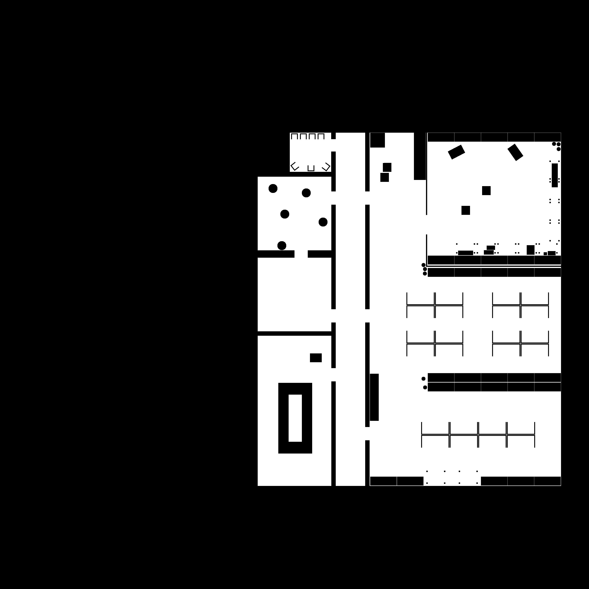

**Map result:**

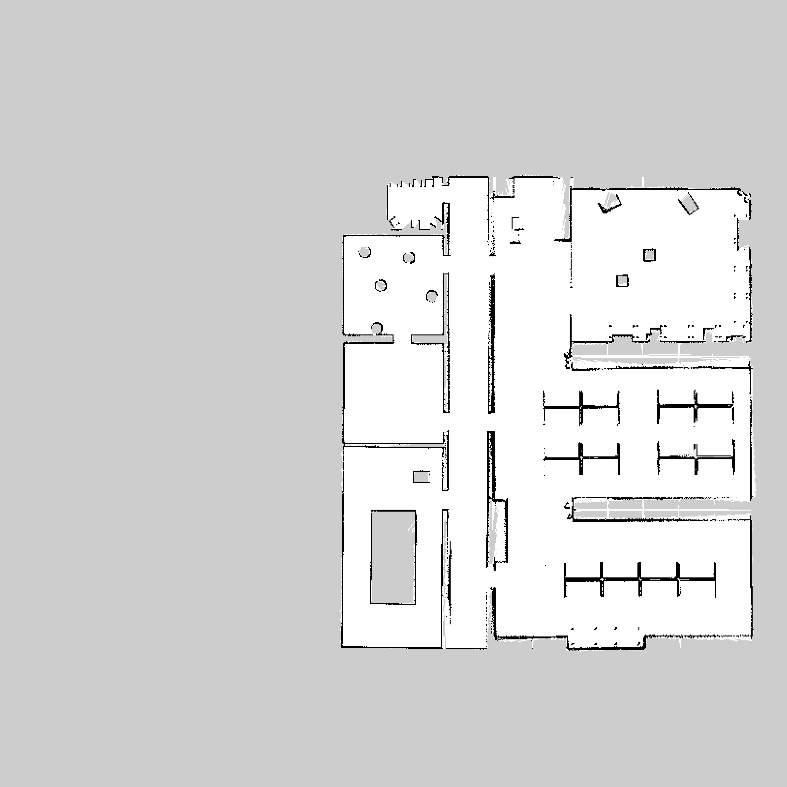

**Map error:**

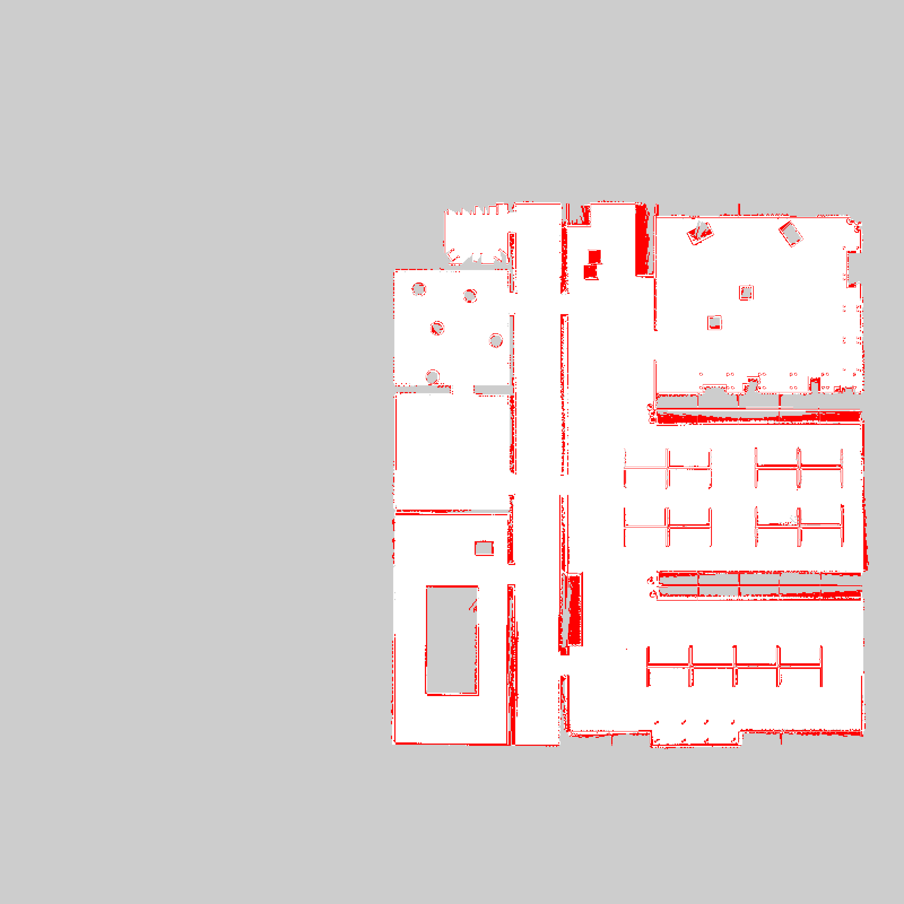

**Map confusion:**

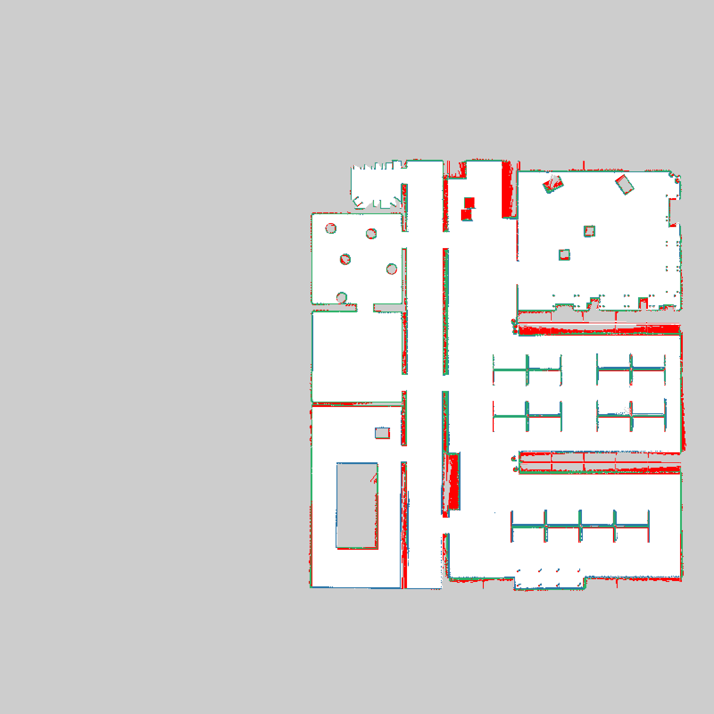

Grey = not_evaluated, Green = TP, White = TN, Blue = FP, RED = FN

**Map robot_0:**

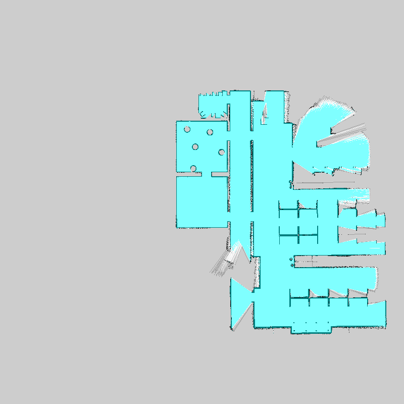

**Map robot_1:**

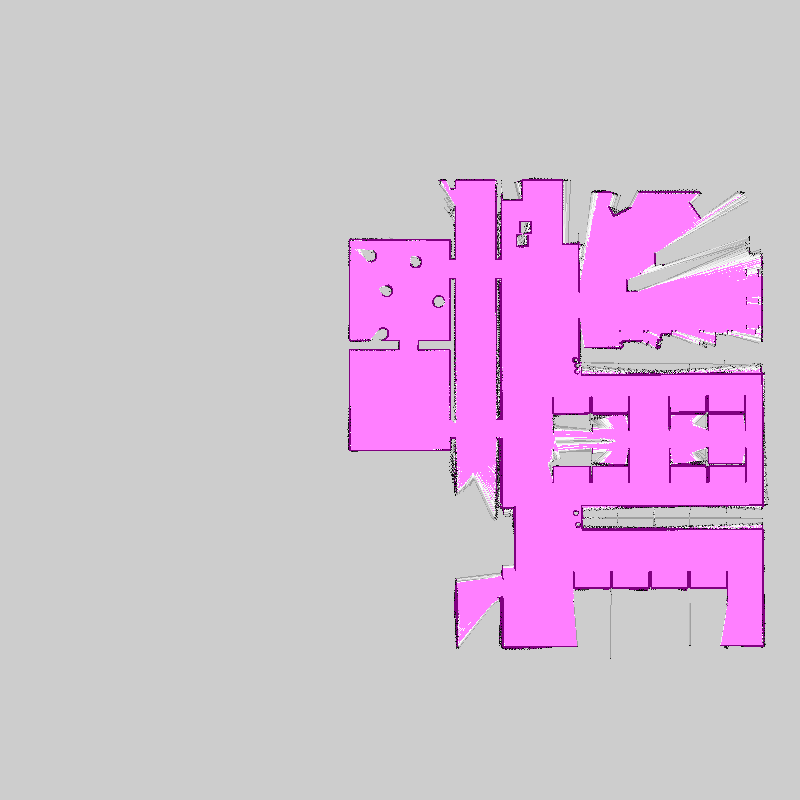

**Map robot_2:**

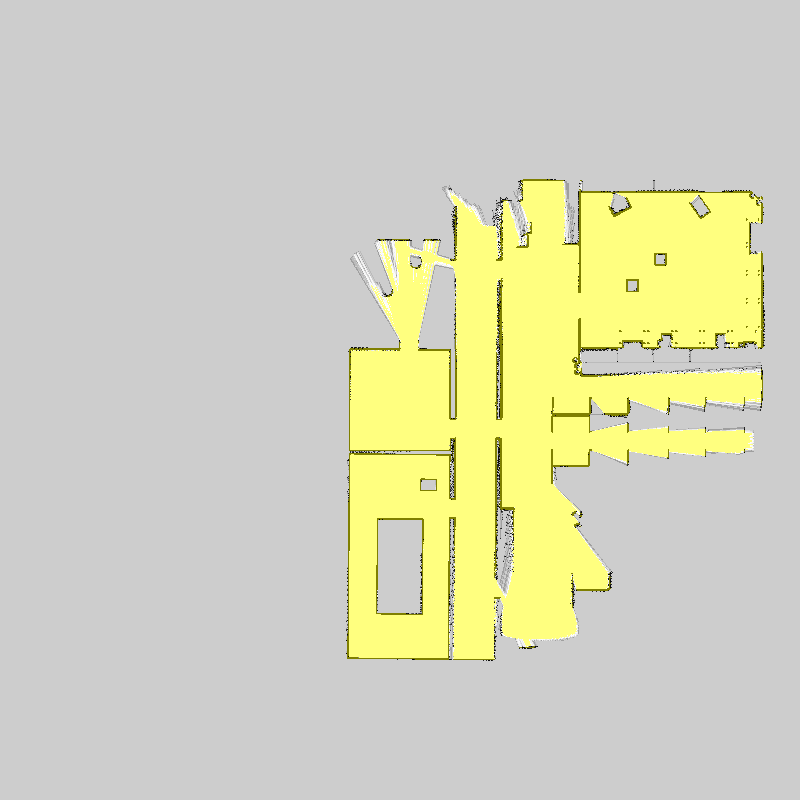

**Map merged:**

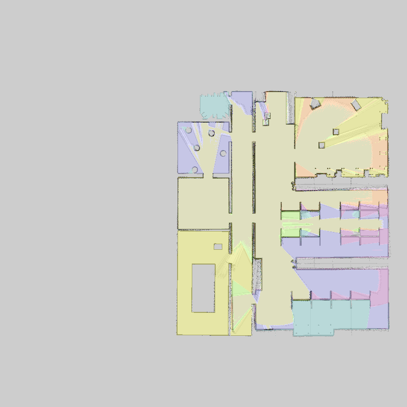

**Map merged with robot trajectories:**

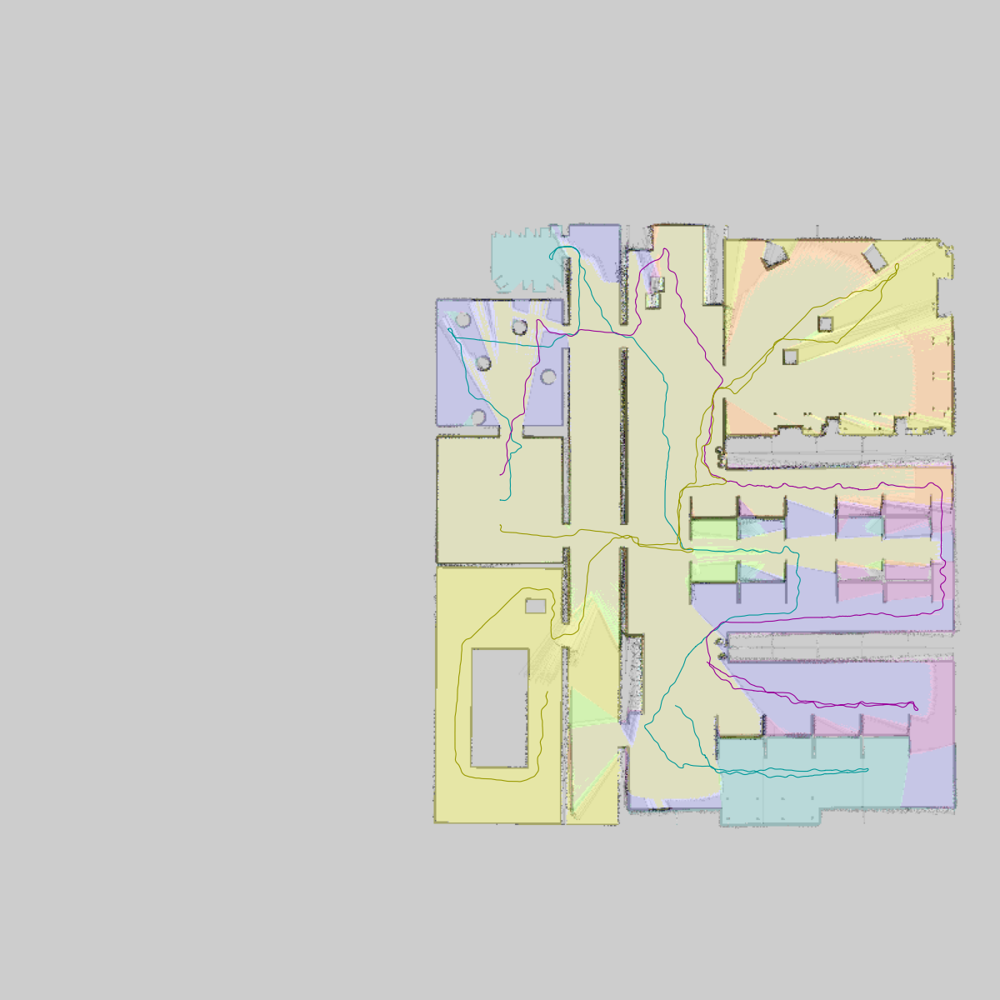

